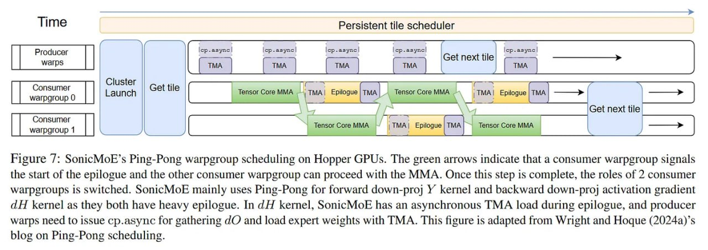

# Image Description

**File:** img_1766679721_aqadyw9rgwhcyep_figure_7_sonicmoe_s_ping_pong_warpgroup_.jpg
**Original:** image.jpg
**Received:** 1766679721

## Extracted Text (OCR)

Figure 7: SonicMoE's Ping-Pong warpgroup scheduling on Hopper GPUs. The green arrows indicate that a consumer warpgroup signals the start of the epilogue and the other consumer warpgroup can proceed with the MMA. Once this step 1s complete, the roles of 2 consumer warpgroups 1$ switched. SonicMoE mainly uses Ping-Pong for forward down-pro) У kernel and backward down-pro] activation gradient ЧН kernel as they both have heavy epilogue. In dH kernel, SonicMoE has an asynchronous TMA load during epilogue, and producer warps need to issue cp.asyne for gathering dV and load expert weights with TMA. This figure 1s adapted from Wright and Hoque (2024a)'s blog on Ping-Pong scheduling,

<!-- image -->

## Usage Instructions

When referencing this image in markdown:
1. Use relative path based on file location
2. Add descriptive alt text based on OCR content above
3. Add text description BELOW the image for GitHub rendering

Example:
```markdown
 <!-- TODO: Broken image path -->

**Image shows:** [Describe what the image contains based on OCR]
```
