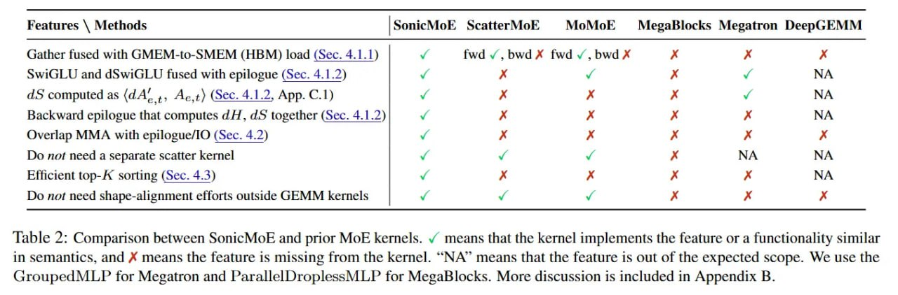

# Image Description

**File:** img_1766679721_aqadza9rgwhcyep_table_2_comparison_between_sonicmoe_and.jpg
**Original:** image.jpg
**Received:** 1766679721

## Extracted Text (OCR)

Table 2: Comparison between SonicMoE and prior MoE kernels. v means that the kernel implements the feature or a functionality similar in semantics, and X means the feature is missing from the kernel. "МА" means that the feature ts out of the expected scope. We use the GroupedMLP for Megatron and ParallelDroplessMLP for MegaBlocks. More discussion 15 included in Appendix В.

<!-- image -->

| Features \ Methods                                           | SonicMoE ScatterMoE   | Vio  Viok,   |               | MegaBlocks Megatron DeepGEMM   |
|--------------------------------------------------------------|-----------------------|--------------|---------------|--------------------------------|
| Gather fused with GMEM-to-SMEM (HBM) load (Sec. 4.1.1)       | fwd. Ба А twdv,bwdX   |              |               |                                |
| SwiGLU and dSwiGLuU fused with epilogue (Sec. 4.1.2)         |                       |              |               |                                |
| dS computed as (d A‘, one Ae,t) (Sec. 4.1.2, App. C.1)       |                       |              |               | МА                             |
| Backward epilogue that computes aH, а5 together (Sec. 4.1.2) |                       |              |               | МА                             |
| Overlap MMA with epilogue/IO (Sec. 4.2)                      |                       |              |               |                                |
| Do not need a separate scatter kernel!                       |                       |              |               |                                |
| Efficient top-A sorting (Sec. 4.3)                           | x Ч О »}» XX >        |              | x м м м KX XK |                                |
| Do not need shape-alignment efforts outside GEMM kernels     |                       |              |               |                                |

## Usage Instructions

When referencing this image in markdown:
1. Use relative path based on file location
2. Add descriptive alt text based on OCR content above
3. Add text description BELOW the image for GitHub rendering

Example:
```markdown
 <!-- TODO: Broken image path -->

**Image shows:** [Describe what the image contains based on OCR]
```
