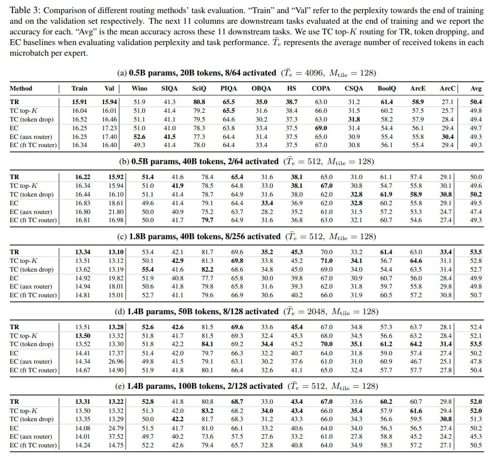

# Image Description

**File:** img_1766679721_aqadzg9rgwhcyep_table_3_comparison_of_different_routing.jpg
**Original:** image.jpg
**Received:** 1766679721

## Extracted Text (OCR)

Table 3: Comparison of different routing methods' task evaluation. "Train" and "Val" refer to the perplexity towards the end of training and on the validation set respectively. The next |1 columns are downstream tasks evaluated at the end of training and we report the accuracy for each. "Ами" is the mean accuracy across these || downstream tasks. We use TC top-/A routing for TR, token dropping, and EC baselines when evaluating validation perplexity and task performance. 7. represents the average number of received tokens in each microbatch per expert.

(a) 0.5B params, 20B tokens, 8/64 activated (7. = 4096, M,,,. = 128)

|                                                                                              |                                                                                              | Method | Train Val | Wino SIQA МЮ PIOA OBQA HS COPA CSQA BoolQ <ArcE ArcC|— Ave   |                                                                        |                                                                        |                                                                        |                                                                        |                                                                        |                                                                        |                                                                        |                                                                        |                                                                        |                                                                        |                                                                        |                                                                        |
|----------------------------------------------------------------------------------------------|----------------------------------------------------------------------------------------------|-----------------------------------------------------------------------------------|------------------------------------------------------------------------|------------------------------------------------------------------------|------------------------------------------------------------------------|------------------------------------------------------------------------|------------------------------------------------------------------------|------------------------------------------------------------------------|------------------------------------------------------------------------|------------------------------------------------------------------------|------------------------------------------------------------------------|------------------------------------------------------------------------|------------------------------------------------------------------------|------------------------------------------------------------------------|
|                                                                                              | TR  15.91  15.94 |  51.9  41.3  80.8  65.5  35.0  38.7  63.0  31.2  614  58.9  27.1 |  50.3  |                                                                                   |                                                                        |                                                                        |                                                                        |                                                                        |                                                                        |                                                                        |                                                                        |                                                                        |                                                                        |                                                                        |                                                                        |                                                                        |
| TC гор | 16.04 16.01 | 51.0 41.4 792 65.5 31.6 38.4 66.0) 315 60.2 57.5 25.7 | 498           |                                                                                              |                                                                                   |                                                                        |                                                                        |                                                                        |                                                                        |                                                                        |                                                                        |                                                                        |                                                                        |                                                                        |                                                                        |                                                                        |                                                                        |
| TC (token drop) | 16.52 16.46 | 51.1 41.1 TWA 64.6 AU? 373 83.0 кую. 58.1 579 38.4] 494      |                                                                                              |                                                                                   |                                                                        |                                                                        |                                                                        |                                                                        |                                                                        |                                                                        |                                                                        |                                                                        |                                                                        |                                                                        |                                                                        |                                                                        |
| EC (aux router) | 16.25 17.40 | 52.6 415 Vt. 64.4 31.3 37.9 65.0 30.9 55.4 55.5 M4) 493      |                                                                                              |                                                                                   |                                                                        |                                                                        |                                                                        |                                                                        |                                                                        |                                                                        |                                                                        |                                                                        |                                                                        |                                                                        |                                                                        |                                                                        |
| EC (ft TC router) | 16.354 16.40 | 493 41.4 78.0 64.4 334 ЗРЯ 6:0 S08 56 ] 554 94|  49з      |                                                                                              |                                                                                   |                                                                        |                                                                        |                                                                        |                                                                        |                                                                        |                                                                        |                                                                        |                                                                        |                                                                        |                                                                        |                                                                        |                                                                        |
| (b) 0.SB params, 40B tokens, 2/64 activated ( T. = 512, АЛие = 128)                          | (b) 0.SB params, 40B tokens, 2/64 activated ( T. = 512, АЛие = 128)                          | (b) 0.SB params, 40B tokens, 2/64 activated ( T. = 512, АЛие = 128)               | (b) 0.SB params, 40B tokens, 2/64 activated ( T. = 512, АЛие = 128)    | (b) 0.SB params, 40B tokens, 2/64 activated ( T. = 512, АЛие = 128)    | (b) 0.SB params, 40B tokens, 2/64 activated ( T. = 512, АЛие = 128)    | (b) 0.SB params, 40B tokens, 2/64 activated ( T. = 512, АЛие = 128)    | (b) 0.SB params, 40B tokens, 2/64 activated ( T. = 512, АЛие = 128)    | (b) 0.SB params, 40B tokens, 2/64 activated ( T. = 512, АЛие = 128)    | (b) 0.SB params, 40B tokens, 2/64 activated ( T. = 512, АЛие = 128)    | (b) 0.SB params, 40B tokens, 2/64 activated ( T. = 512, АЛие = 128)    | (b) 0.SB params, 40B tokens, 2/64 activated ( T. = 512, АЛие = 128)    | (b) 0.SB params, 40B tokens, 2/64 activated ( T. = 512, АЛие = 128)    | (b) 0.SB params, 40B tokens, 2/64 activated ( T. = 512, АЛие = 128)    | (b) 0.SB params, 40B tokens, 2/64 activated ( T. = 512, АЛие = 128)    |
|                                                                                              | TR  16.22  15.92 |  51.4  41.6  78.4  65.4  31.6  38.1  65.0  31.0  61.1  57.4  29.1 |  50.0 |                                                                                   |                                                                        |                                                                        |                                                                        |                                                                        |                                                                        |                                                                        |                                                                        |                                                                        |                                                                        |                                                                        |                                                                        |                                                                        |
| TC top- A | 16.34 1594] 451.0 41.9 78.5 64.8 33.0 38.1 67.0 30.8 54.7 55.8 AULT] 4956        |                                                                                              |                                                                                   |                                                                        |                                                                        |                                                                        |                                                                        |                                                                        |                                                                        |                                                                        |                                                                        |                                                                        |                                                                        |                                                                        |                                                                        |
| TC (token drop) | 16.44 16.10) St.) 41.4 7%? 4.9 31.6 35.0 62.0 325 619 55.9 0.8) S02        |                                                                                              |                                                                                   |                                                                        |                                                                        |                                                                        |                                                                        |                                                                        |                                                                        |                                                                        |                                                                        |                                                                        |                                                                        |                                                                        |                                                                        |
| 16.84  IR All  Аб  dja  то |  ма  a Y  И  5чя                                                |                                                                                              |                                                                                   |                                                                        |                                                                        |                                                                        |                                                                        |                                                                        |                                                                        |                                                                        |                                                                        |                                                                        |                                                                        |                                                                        |                                                                        |
| EC (aux router) | 16.50 21.80 | 50.0 40.4 F ba 63.7 28.2 35.2 61.0 315 57.2 53.3 247] 474    |                                                                                              |                                                                                   |                                                                        |                                                                        |                                                                        |                                                                        |                                                                        |                                                                        |                                                                        |                                                                        |                                                                        |                                                                        |                                                                        |                                                                        |
| EC (ft TC router) | 16.81 16.98 | 50.0 41.7 У 1.9 31.6 56.8 63.0 371 607 54.6 24 | 49 3      |                                                                                              |                                                                                   |                                                                        |                                                                        |                                                                        |                                                                        |                                                                        |                                                                        |                                                                        |                                                                        |                                                                        |                                                                        |                                                                        |                                                                        |
| (с) L.8B params, 40B tokens, 8/256 activated (T. = 512. Mine = 128)                          | (с) L.8B params, 40B tokens, 8/256 activated (T. = 512. Mine = 128)                          | (с) L.8B params, 40B tokens, 8/256 activated (T. = 512. Mine = 128)               | (с) L.8B params, 40B tokens, 8/256 activated (T. = 512. Mine = 128)    | (с) L.8B params, 40B tokens, 8/256 activated (T. = 512. Mine = 128)    | (с) L.8B params, 40B tokens, 8/256 activated (T. = 512. Mine = 128)    | (с) L.8B params, 40B tokens, 8/256 activated (T. = 512. Mine = 128)    | (с) L.8B params, 40B tokens, 8/256 activated (T. = 512. Mine = 128)    | (с) L.8B params, 40B tokens, 8/256 activated (T. = 512. Mine = 128)    | (с) L.8B params, 40B tokens, 8/256 activated (T. = 512. Mine = 128)    | (с) L.8B params, 40B tokens, 8/256 activated (T. = 512. Mine = 128)    | (с) L.8B params, 40B tokens, 8/256 activated (T. = 512. Mine = 128)    | (с) L.8B params, 40B tokens, 8/256 activated (T. = 512. Mine = 128)    | (с) L.8B params, 40B tokens, 8/256 activated (T. = 512. Mine = 128)    | (с) L.8B params, 40B tokens, 8/256 activated (T. = 512. Mine = 128)    |
|                                                                                              | 14.44  93101  534  ae? |  ai of  ho  ADO  337  $14                                           |                                                                                   |                                                                        |                                                                        |                                                                        |                                                                        |                                                                        |                                                                        |                                                                        |                                                                        |                                                                        |                                                                        |                                                                        |                                                                        |
| TC top- A | 13.51 13.12] 50.1 42.9 B13 69.5 338 452 TLO 34.1 56.7 64.6 7 ie | 52.8           |                                                                                              |                                                                                   |                                                                        |                                                                        |                                                                        |                                                                        |                                                                        |                                                                        |                                                                        |                                                                        |                                                                        |                                                                        |                                                                        |                                                                        |
| TC (token drop) | 13.62 13.19] 55.4 41.6 82.2 65.6 34.8 45.0 64.0) 34.0) 54.4 63.5 31.4) 51. |                                                                                              |                                                                                   |                                                                        |                                                                        |                                                                        |                                                                        |                                                                        |                                                                        |                                                                        |                                                                        |                                                                        |                                                                        |                                                                        |                                                                        |
| 149?  19971  S19  TTY  Aas  bit  309                                                         |                                                                                              |                                                                                   |                                                                        |                                                                        |                                                                        |                                                                        |                                                                        |                                                                        |                                                                        |                                                                        |                                                                        |                                                                        |                                                                        |                                                                        |
| EC (aux router) | 14.94 18.01 | S06 41.8 TOS 65.58 31.6 493 62.0 S14 59.7 55.5 29% | 49.4    |                                                                                              |                                                                                   |                                                                        |                                                                        |                                                                        |                                                                        |                                                                        |                                                                        |                                                                        |                                                                        |                                                                        |                                                                        |                                                                        |                                                                        |
| EC (ft TC router) | 14.51] TS.01 | bs 41.1 196 66.9 30.6 40.2 66.0 31$ O45 572 Я | 50.7      |                                                                                              |                                                                                   |                                                                        |                                                                        |                                                                        |                                                                        |                                                                        |                                                                        |                                                                        |                                                                        |                                                                        |                                                                        |                                                                        |                                                                        |
| (d) 1.4B params, 50B tokens, 8/128 activated (ТГ. = 2048, Mii. = 128)                        | (d) 1.4B params, 50B tokens, 8/128 activated (ТГ. = 2048, Mii. = 128)                        | (d) 1.4B params, 50B tokens, 8/128 activated (ТГ. = 2048, Mii. = 128)             | (d) 1.4B params, 50B tokens, 8/128 activated (ТГ. = 2048, Mii. = 128)  | (d) 1.4B params, 50B tokens, 8/128 activated (ТГ. = 2048, Mii. = 128)  | (d) 1.4B params, 50B tokens, 8/128 activated (ТГ. = 2048, Mii. = 128)  | (d) 1.4B params, 50B tokens, 8/128 activated (ТГ. = 2048, Mii. = 128)  | (d) 1.4B params, 50B tokens, 8/128 activated (ТГ. = 2048, Mii. = 128)  | (d) 1.4B params, 50B tokens, 8/128 activated (ТГ. = 2048, Mii. = 128)  | (d) 1.4B params, 50B tokens, 8/128 activated (ТГ. = 2048, Mii. = 128)  | (d) 1.4B params, 50B tokens, 8/128 activated (ТГ. = 2048, Mii. = 128)  | (d) 1.4B params, 50B tokens, 8/128 activated (ТГ. = 2048, Mii. = 128)  | (d) 1.4B params, 50B tokens, 8/128 activated (ТГ. = 2048, Mii. = 128)  | (d) 1.4B params, 50B tokens, 8/128 activated (ТГ. = 2048, Mii. = 128)  | (d) 1.4B params, 50B tokens, 8/128 activated (ТГ. = 2048, Mii. = 128)  |
|                                                                                              | TR  13.51  13.28 |  52.6  42.6  31.5  69.6  33.6  45.4  67.0  34.8  63.7  28.1 |  52.4       |                                                                                   |                                                                        |                                                                        |                                                                        |                                                                        |                                                                        |                                                                        |                                                                        |                                                                        |                                                                        |                                                                        |                                                                        |                                                                        |
| TC top- | 13.50 13.352 | 51.8 417 81.5 69.3 324 453 68.0) 34.5 56.6 63.2 28.4 | 52.1         |                                                                                              |                                                                                   |                                                                        |                                                                        |                                                                        |                                                                        |                                                                        |                                                                        |                                                                        |                                                                        |                                                                        |                                                                        |                                                                        |                                                                        |
| TC (token drop) | 13.52 13.30) S1L& 42.1 84.1 69.2 33.4 45.2 TO. 35.1 61.2 64.2 S14) 453.5   |                                                                                              |                                                                                   |                                                                        |                                                                        |                                                                        |                                                                        |                                                                        |                                                                        |                                                                        |                                                                        |                                                                        |                                                                        |                                                                        |                                                                        |
| 14 4]  17371  %] 4  wai}  ТУТ  47  STA                                                       |                                                                                              |                                                                                   |                                                                        |                                                                        |                                                                        |                                                                        |                                                                        |                                                                        |                                                                        |                                                                        |                                                                        |                                                                        |                                                                        |                                                                        |
| EC (aux router) | 1434 26.96 | 495 41.45 79.1 63.1 30,2 47.6 61.0 31.0 6.9 46.7 25.1 | 47.8  |                                                                                              |                                                                                   |                                                                        |                                                                        |                                                                        |                                                                        |                                                                        |                                                                        |                                                                        |                                                                        |                                                                        |                                                                        |                                                                        |                                                                        |
| EC (ft TC router) | 14607 14.90 | 51.9 41.8 #01 56.4 320 41.1 65.0 324 37.7 57.7 21.8 | 50.4 |                                                                                              |                                                                                   |                                                                        |                                                                        |                                                                        |                                                                        |                                                                        |                                                                        |                                                                        |                                                                        |                                                                        |                                                                        |                                                                        |                                                                        |
| (ec) 1.4B params, 100B tokens, 2/128 activated (7T.. = 512, АЛ, = 128)                       | (ec) 1.4B params, 100B tokens, 2/128 activated (7T.. = 512, АЛ, = 128)                       | (ec) 1.4B params, 100B tokens, 2/128 activated (7T.. = 512, АЛ, = 128)            | (ec) 1.4B params, 100B tokens, 2/128 activated (7T.. = 512, АЛ, = 128) | (ec) 1.4B params, 100B tokens, 2/128 activated (7T.. = 512, АЛ, = 128) | (ec) 1.4B params, 100B tokens, 2/128 activated (7T.. = 512, АЛ, = 128) | (ec) 1.4B params, 100B tokens, 2/128 activated (7T.. = 512, АЛ, = 128) | (ec) 1.4B params, 100B tokens, 2/128 activated (7T.. = 512, АЛ, = 128) | (ec) 1.4B params, 100B tokens, 2/128 activated (7T.. = 512, АЛ, = 128) | (ec) 1.4B params, 100B tokens, 2/128 activated (7T.. = 512, АЛ, = 128) | (ec) 1.4B params, 100B tokens, 2/128 activated (7T.. = 512, АЛ, = 128) | (ec) 1.4B params, 100B tokens, 2/128 activated (7T.. = 512, АЛ, = 128) | (ec) 1.4B params, 100B tokens, 2/128 activated (7T.. = 512, АЛ, = 128) | (ec) 1.4B params, 100B tokens, 2/128 activated (7T.. = 512, АЛ, = 128) | (ec) 1.4B params, 100B tokens, 2/128 activated (7T.. = 512, АЛ, = 128) |
|                                                                                              | TR  13.31  13.22 |  52.8  41.8  80.8  68.7  33.0  43.4  67.0  33.6  60.2  60.7  29.8 |  52.0 |                                                                                   |                                                                        |                                                                        |                                                                        |                                                                        |                                                                        |                                                                        |                                                                        |                                                                        |                                                                        |                                                                        |                                                                        |                                                                        |
| TC юр-^ | 13.50 13.42] 913 41.0 63.2 68.2 34.0 43.4 66.0) 35.4 57.9 61.6 294| 8524           |                                                                                              |                                                                                   |                                                                        |                                                                        |                                                                        |                                                                        |                                                                        |                                                                        |                                                                        |                                                                        |                                                                        |                                                                        |                                                                        |                                                                        |
| TC (token drop) | 13.35 15.29 | 50.0 42.2 aL? 65.3 31.2 434 66.0) 34.5 56.6 59.5 SU. | 51.1  |                                                                                              |                                                                                   |                                                                        |                                                                        |                                                                        |                                                                        |                                                                        |                                                                        |                                                                        |                                                                        |                                                                        |                                                                        |                                                                        |                                                                        |
|                                                                                              | S145  ДЕТ  406  fel Я |                                                                      |                                                                                   |                                                                        |                                                                        |                                                                        |                                                                        |                                                                        |                                                                        |                                                                        |                                                                        |                                                                        |                                                                        |                                                                        |                                                                        |
| EC (aux router) | 14.0] SP | 497 4013 74.6 575 Pan a} 459 61.0 TTB a8.8 45.3 249 | 45.3      |                                                                                              |                                                                                   |                                                                        |                                                                        |                                                                        |                                                                        |                                                                        |                                                                        |                                                                        |                                                                        |                                                                        |                                                                        |                                                                        |                                                                        |
| EC (fi TC rowter) |  1424  14.745]  5  Бы be  43.6  794  645.7  328  408  АУ  553  ST        |                                                                                              |                                                                                   |                                                                        |                                                                        |                                                                        |                                                                        |                                                                        |                                                                        |                                                                        |                                                                        |                                                                        |                                                                        |                                                                        |                                                                        |

## Usage Instructions

When referencing this image in markdown:
1. Use relative path based on file location
2. Add descriptive alt text based on OCR content above
3. Add text description BELOW the image for GitHub rendering

Example:
```markdown
 <!-- TODO: Broken image path -->

**Image shows:** [Describe what the image contains based on OCR]
```
