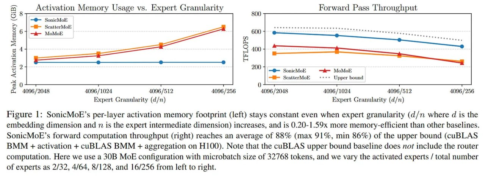

# Image Description

**File:** img_1766679721_aqadzq9rgwhcyep_figure_sonicmoe_s_per_layer_activation_m.jpg
**Original:** image.jpg
**Received:** 1766679721

## Extracted Text (OCR)

Figure |: SonicMoE's per-layer activation memory footprint (left) stays constant even when expert granularity (d/n where d is the embedding dimension and п 1$ the expert intermediate dimension) increases, and 1$ 0.20-1.59x more memory-efficient than other baselines. SsonicMoE's forward computation throughput (right) reaches an average of 88% (max 91%, min 86%) of the upper bound (cuBLAS BMM + activation + cuBLAS BMM + aggregation on 9100). Note that the cuBLAS upper bound baseline does nor include the router computation. Here we use а 30B MoE configuration with microbatch size of 32768 tokens, and we vary the activated experts / total number of experts as 2/32, 4/64, 8/128, and 16/256 from left to right.

<!-- image -->

## Usage Instructions

When referencing this image in markdown:
1. Use relative path based on file location
2. Add descriptive alt text based on OCR content above
3. Add text description BELOW the image for GitHub rendering

Example:
```markdown
 <!-- TODO: Broken image path -->

**Image shows:** [Describe what the image contains based on OCR]
```
