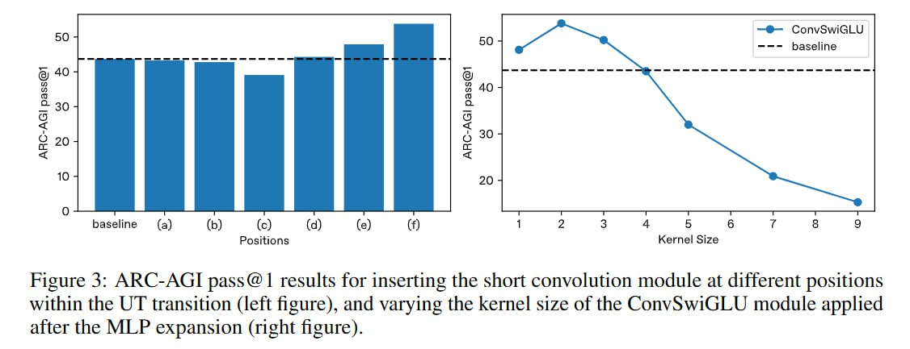

# Image Description

**File:** img_1766732235_aqadhhfrgx6kuep_figure_3_arc_agi_pass_1_results.jpg
**Original:** image.jpg
**Received:** 1766732235

## Extracted Text (OCR)

Figure 3: ARC-AGI pass@ 1 results for Inserting the short convolution module at different positions within the UT transition (leit figure), and varying the kernel size of the ConvSwiGLU module applied after the МЕР expansion (right figure).

<!-- image -->

## Usage Instructions

When referencing this image in markdown:
1. Use relative path based on file location
2. Add descriptive alt text based on OCR content above
3. Add text description BELOW the image for GitHub rendering

Example:
```markdown
 <!-- TODO: Broken image path -->

**Image shows:** [Describe what the image contains based on OCR]
```
