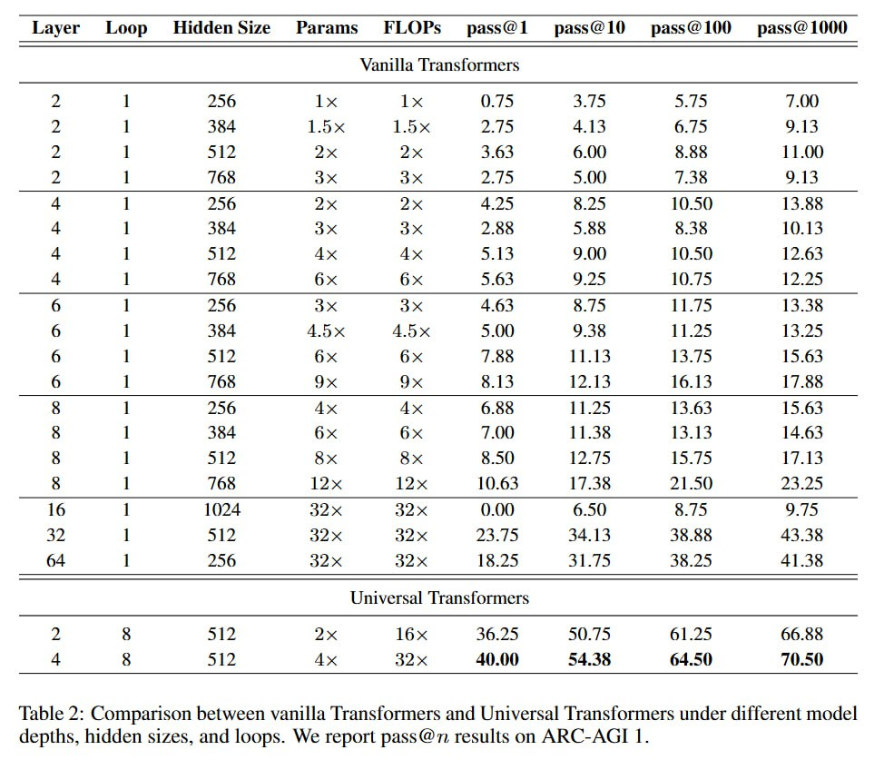

# Image Description

**File:** img_1766732235_aqadhrfrgx6kuep_table_2_comparison_between_vanilla_trans.jpg
**Original:** image.jpg
**Received:** 1766732235

## Extracted Text (OCR)

Table 2: Comparison between vanilla Transformers and Universal Transformers under different mode! depths, hidden sizes, and loops. We report pass@n. results on ARC-AGI 1.

|                          | Layer Loop  HiddenSize Params FLOPs' pass@1  pass@10) pass@100 = pass@1000   |                                    |                          |                          |                          |                          |                          |                          |
|--------------------------|------------------------------------------------------------------------------|------------------------------------|--------------------------|--------------------------|--------------------------|--------------------------|--------------------------|--------------------------|
| Vanilla lranstomnmers    | Vanilla lranstomnmers                                                        | Vanilla lranstomnmers              | Vanilla lranstomnmers    | Vanilla lranstomnmers    | Vanilla lranstomnmers    | Vanilla lranstomnmers    | Vanilla lranstomnmers    | Vanilla lranstomnmers    |
|                          |                                                                              | 454 L5ox 1.5х 2.25 4134 6./5 О 14  |                          |                          |                          |                          |                          |                          |
|                          |                                                                              | 165 4x НХ 2.1/9 5.00 7.35 9 14     |                          |                          |                          |                          |                          |                          |
|                          |                                                                              | 454 4x Хх 2.58 55 К. 3“ 10.13      |                          |                          |                          |                          |                          |                          |
|                          |                                                                              | S12? Ax Ax S 134 9) 1U.50) 12.63   |                          |                          |                          |                          |                          |                          |
|                          |                                                                              | 165 бх 6х 5.63 gs Г 17.25          |                          |                          |                          |                          |                          |                          |
|                          |                                                                              | 256 ae 4x 4 63 B./5 1.75 13.348    |                          |                          |                          |                          |                          |                          |
|                          |                                                                              | 454 45x 45x SOO) O45 11.45 13.25   |                          |                          |                          |                          |                          |                          |
|                          |                                                                              | 165 Эх 9х <. |3 17.14 16.134 1/.8  |                          |                          |                          |                          |                          |                          |
|                          |                                                                              | SI? Sx ax 620) 127. /5 15.25 17.15 |                          |                          |                          |                          |                          |                          |
|                          |                                                                              | 1/386                              |                          |                          |                          |                          |                          |                          |
|                          |                                                                              | 3] 75                              |                          |                          |                          |                          |                          |                          |
| Liniversal |lranstormers | Liniversal |lranstormers                                                     | Liniversal |lranstormers           | Liniversal |lranstormers | Liniversal |lranstormers | Liniversal |lranstormers | Liniversal |lranstormers | Liniversal |lranstormers | Liniversal |lranstormers |
|                          |                                                                              | S4 38                              |                          |                          |                          |                          |                          |                          |

## Usage Instructions

When referencing this image in markdown:
1. Use relative path based on file location
2. Add descriptive alt text based on OCR content above
3. Add text description BELOW the image for GitHub rendering

Example:
```markdown
 <!-- TODO: Broken image path -->

**Image shows:** [Describe what the image contains based on OCR]
```
