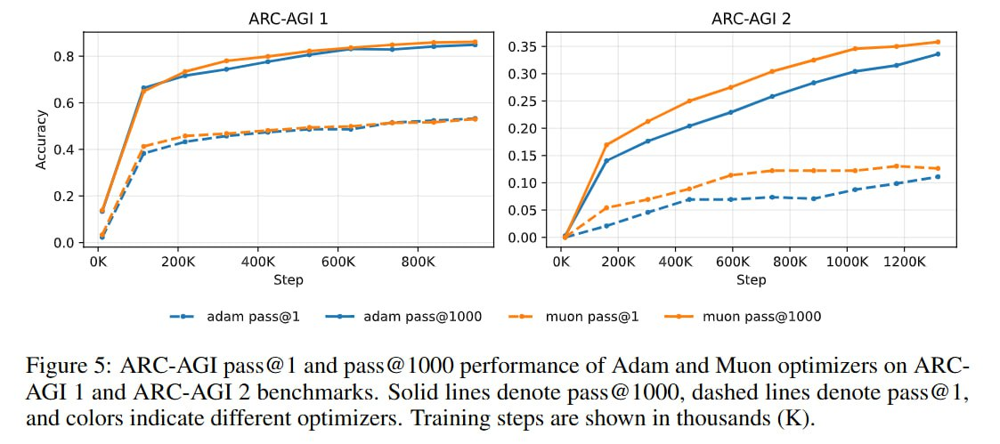

# Image Description

**File:** img_1766732235_aqadihfrgx6kuep_figure_5_arc_agi_pass_and.jpg
**Original:** image.jpg
**Received:** 1766732235

## Extracted Text (OCR)

Figure 5: ARC-AGI pass@ | and pass @ [000 performance of Adam and Muon optimizers on ARCAGI | and ARC-AGI 2 benchmarks. Solid lines denote pass @ 1000, dashed lines denote pass@ |, and colors indicate different optimizers. Training steps are shown ш thousands (K).

<!-- image -->

## Usage Instructions

When referencing this image in markdown:
1. Use relative path based on file location
2. Add descriptive alt text based on OCR content above
3. Add text description BELOW the image for GitHub rendering

Example:
```markdown
 <!-- TODO: Broken image path -->

**Image shows:** [Describe what the image contains based on OCR]
```
