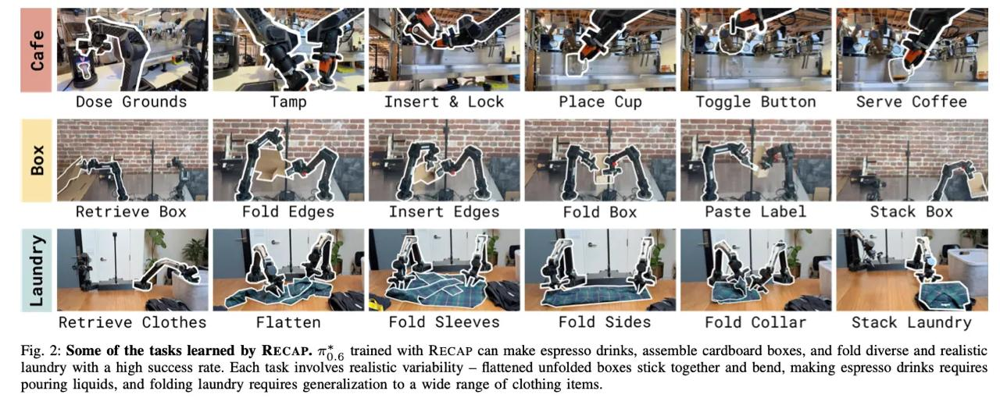

# Image Description

**File:** img_1767180102_aqad5gxrg63oiup_image_image.jpg
**Original:** image.jpg
**Received:** 1767180102

## Extracted Text (OCR)

<!-- image -->

<!-- image -->

<!-- image -->

<!-- image -->

<!-- image -->

<!-- image -->

<!-- image -->

<!-- image -->

<!-- image -->

<!-- image -->

<!-- image -->

<!-- image -->

<!-- image -->

<!-- image -->

<!-- image -->

<!-- image -->

<!-- image -->

<!-- image -->

Retrieve Clothes Flatten Fold Sleeves Fold Sides Fold Collar Stack Laundry

Fig. 2: Some of the tasks learned by RECAP. 7, с trained with RECAP can make espresso drinks, assemble cardboard boxes, and fold diverse and realistic laundry with a high success rate. Each task involves realistic variability — flattened unfolded boxes stick together and bend, making espresso drinks requires pouring liquids, and folding laundry requires generalization to a wide range of clothing items.

## Usage Instructions

When referencing this image in markdown:
1. Use relative path based on file location
2. Add descriptive alt text based on OCR content above
3. Add text description BELOW the image for GitHub rendering

Example:
```markdown
 <!-- TODO: Broken image path -->

**Image shows:** [Describe what the image contains based on OCR]
```
