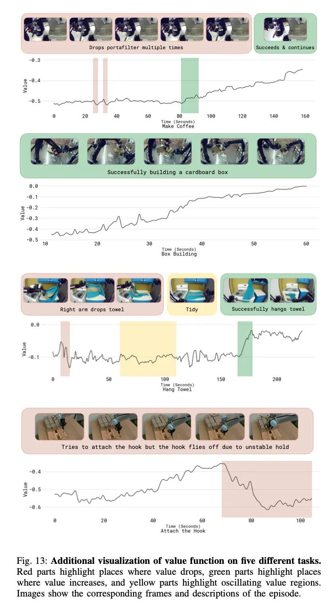

# Image Description

**File:** img_1767180102_aqad6qxrg63oiup_fig_13_additional_visualization_of_value.jpg
**Original:** image.jpg
**Received:** 1767180102

## Extracted Text (OCR)

Fig. 13: Additional visualization of value function on five different tasks. Red parts highlight places where value drops, green parts highlight places where value increases, and yellow parts highlight oscillating value regions. Images show the corresponding frames and descriptions of the episode.

<!-- image -->

## Usage Instructions

When referencing this image in markdown:
1. Use relative path based on file location
2. Add descriptive alt text based on OCR content above
3. Add text description BELOW the image for GitHub rendering

Example:
```markdown
 <!-- TODO: Broken image path -->

**Image shows:** [Describe what the image contains based on OCR]
```
