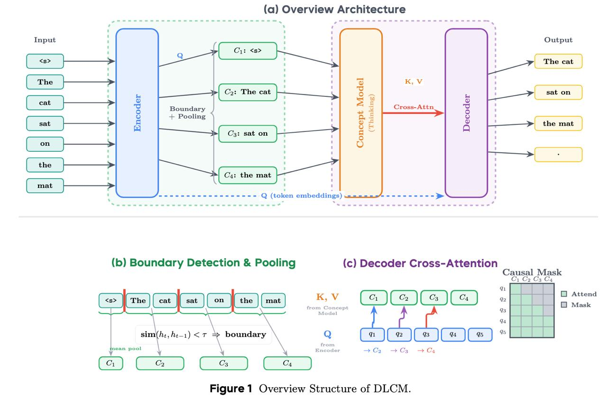

# Image Description

**File:** img_1767781887_aqadywtrg31t0ep_ia_overview_architecture_image.jpg
**Original:** image.jpg
**Received:** 1767781887

## Extracted Text (OCR)

## ia) Overview Architecture

<!-- image -->

(b) Boundary Detection &amp; Pooling

(c) Decoder Cross-Attention

Cl

Чате ee Salat

sonca pt
‚Че

2 (*)(е}(°

Encoder

с

СЗ

Figure 1 Overview Structure of DLCM.

(causal Miask

OC, Os C's Cs

[] Attend

|| Mask

чз

## Usage Instructions

When referencing this image in markdown:
1. Use relative path based on file location
2. Add descriptive alt text based on OCR content above
3. Add text description BELOW the image for GitHub rendering

Example:
```markdown
 <!-- TODO: Broken image path -->

**Image shows:** [Describe what the image contains based on OCR]
```
