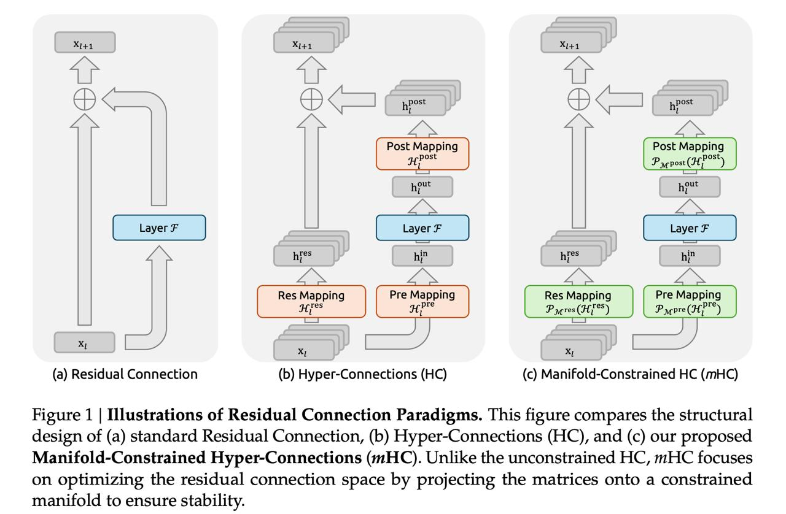

# Image Description

**File:** img_1767781957_aqaddqtrg0n0up_figure_1_illustrations_of_residual.jpg
**Original:** image.jpg
**Received:** 1767781957

## Extracted Text (OCR)

Figure 1 | Illustrations of Residual Connection Paradigms. This figure compares the structural design of (a) standard Residual Connection, (b) Hyper-Connections (HC), and (c) our proposed Manifold-Constrained Hyper-Connections (mHC). Unlike the unconstrained HC, mHC focuses on optimizing the residual connection space by projecting the matrices onto a constrained manifold to ensure stability.

<!-- image -->

## Usage Instructions

When referencing this image in markdown:
1. Use relative path based on file location
2. Add descriptive alt text based on OCR content above
3. Add text description BELOW the image for GitHub rendering

Example:
```markdown
 <!-- TODO: Broken image path -->

**Image shows:** [Describe what the image contains based on OCR]
```
