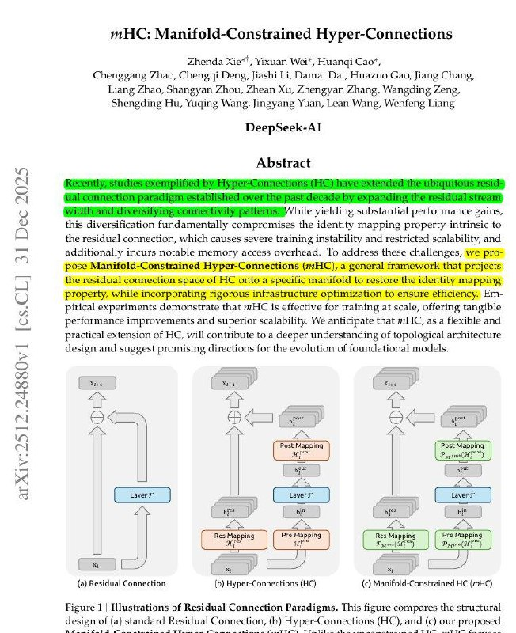

# Image Description

**File:** img_1767782328_aqadgaxrgxqwuup9_mhc_manifold_constrained_hyper_connectio.jpg
**Original:** image.jpg
**Received:** 1767782328

## Extracted Text (OCR)

## mHC: Manifold-Constrained Hyper-Connections

fhenda Хе"', Yixuan ИЛ", Huandgi Сао*, Cheng arg ‚Пао, Chengqi Deng, ashi Li, Damail Dal, пая» Gan, lang Chang, LIATHYE пас, slangyan Ano, Anean Au, дпенхуай éhang, Wandin g Ong, Shengding Hu, Yugme Wang, Jingyang Yuan, Lean Wang, Wenfeng Liang

## DeepSeek-Al

## Abstract

Miata Ча esi inp cote ene petteriens bile yielding substantial performance gains, this diversinication fundamentally compromises the 1denhty mapping property mtrinsic to the residual commechon, which causes severe training instability and restricted scalability, ana аа юпа

incurs notable memory access overhead. lo address these challenges, we proproperty, while incorporating rigorous infrastructure ophmization to ensure efficiency. Empirical experiments. demonstrate that mHiC 18 effective for traming at scale, offering tangible performance Improvements and superior scalability. We anhicipate that mH, asa flexible and practical extension of AC, will contrionute toa deeper understanding of topological architecture design and suggest promising directions for the evolution of foundational models

Figure 1 | [ustrations of Residual Connection Paradigms. [his figure compares the structural! design of (a} standard Residual Connection, (b) Hyper-Connections (НО), and (&lt;) our proposed

<!-- image -->

## Usage Instructions

When referencing this image in markdown:
1. Use relative path based on file location
2. Add descriptive alt text based on OCR content above
3. Add text description BELOW the image for GitHub rendering

Example:
```markdown
 <!-- TODO: Broken image path -->

**Image shows:** [Describe what the image contains based on OCR]
```
