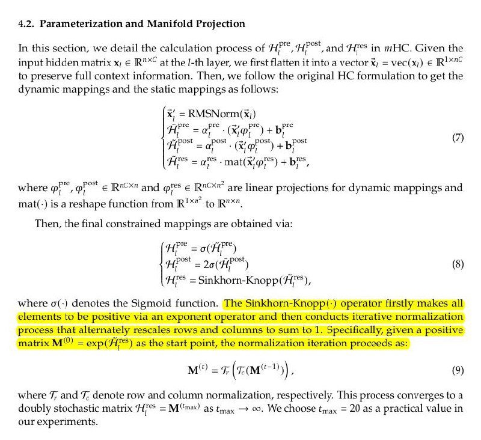

# Image Description

**File:** img_1767782328_aqadggxrgxqwuup9_4_2_parameterization_and_manifold_projec.jpg
**Original:** image.jpg
**Received:** 1767782328

## Extracted Text (OCR)

## 4.2. Parameterization and Manifold Projection

In this section, we detail the calculation process of HP™, HP" and 'H's in mHC. Given the input hidden matrix x, Ее R"** at the I-th layer, we first flatten it into a vector Х, = vec(x;) Е КИ to preserve full context information. Then, we follow the original HC tormulation to ре! the dynamic mappings and the static mappings as follows:

<!-- formula-not-decoded -->

where фР", фр = R™*" and фт € Rx" are linear projections for dynamic mappings and mat(-) is a reshape function from R**" to R"™*".

Then, the tinal constrained mappings are obtained via:

<!-- formula-not-decoded -->

where o(-} denotes the Sigmoid function. The Sinkhorn-Knopp|-) operator firstly makes all

<!-- formula-not-decoded -->

where 7, and 7. denote row and column normalization, respectively. This process converges to a doubly stochastic matrix Hrs = М" та" a8 trax — 00. We choose tmax = 26 as a practical value in our experiments.

## Usage Instructions

When referencing this image in markdown:
1. Use relative path based on file location
2. Add descriptive alt text based on OCR content above
3. Add text description BELOW the image for GitHub rendering

Example:
```markdown
 <!-- TODO: Broken image path -->

**Image shows:** [Describe what the image contains based on OCR]
```
