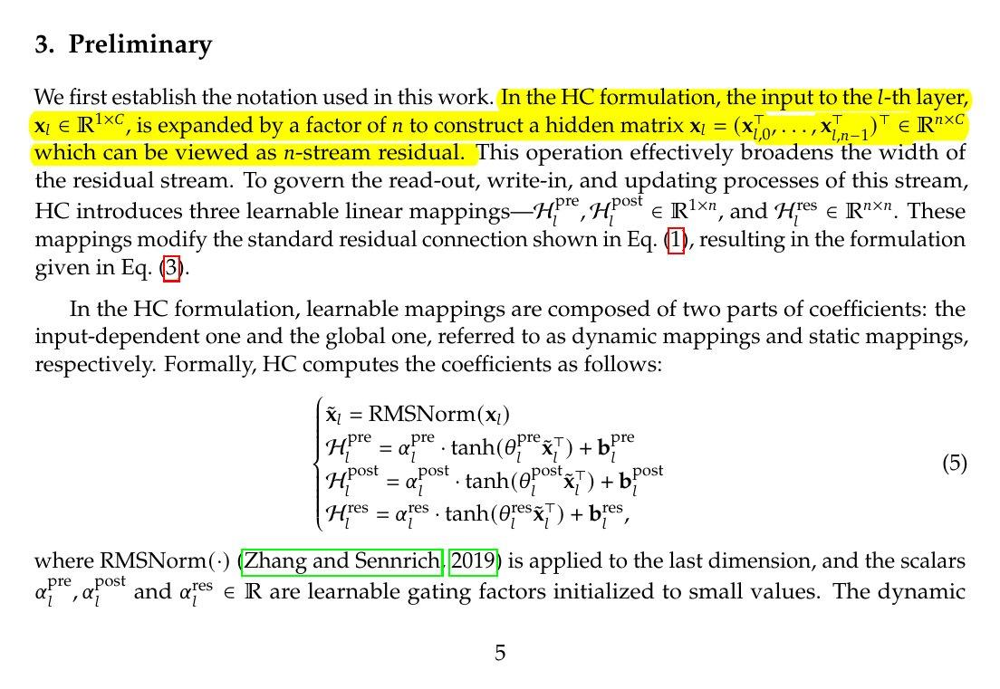

# Image Description

**File:** img_1767782328_aqadgqxrgxqwuup_3_preliminary_we_first_establish.jpg
**Original:** image.jpg
**Received:** 1767782328

## Extracted Text (OCR)

## 3. Preliminary

We first establish the notation used in this work. uich can be viewed as n-stream residual. This operation effectively broadens | the residual stream. То govern the read-out, write-in, and updating processes of this stream, HC introduces three learnable linear mappings—H?™, НР Е ВР", and Hts ¢ R'*". These mappings modify the standard residual connection shown in Eq. (1), resulting in the formulation given in Eq. (3).

In the HC formulation, learnable mappings are composed of two parts of coefficients: the input-dependent one and the global one, referred to as dynamic mappings and static mappings, respectively. Formally, HC computes the coefficients as follows:

<!-- formula-not-decoded -->

where RMSNorm(-) (Zhang and Sennrich}|2019) is applied to the last dimension, and the scalars re OST
{У P ed P

‚ ,a anda; е Rare learnable gating factors initialized to small values. The dynamic

## Usage Instructions

When referencing this image in markdown:
1. Use relative path based on file location
2. Add descriptive alt text based on OCR content above
3. Add text description BELOW the image for GitHub rendering

Example:
```markdown
 <!-- TODO: Broken image path -->

**Image shows:** [Describe what the image contains based on OCR]
```
