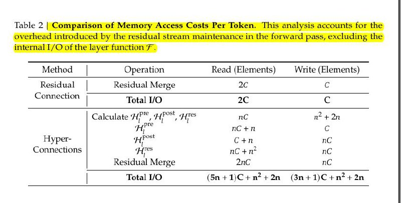

# Image Description

**File:** img_1767782328_aqadgwxrgxqwuup9_method_operation_elements.jpg
**Original:** image.jpg
**Received:** 1767782328

## Extracted Text (OCR)

| Method | Operation Кеаа (Elements) Write (Elements)                                                                     |
|-------------------------------------------------------------------------------------------------------------------------|
| Residual  Residual Merge  2C                                                                                            |
| (_onnechon |  Total О                                                                                                   |
| Calculate HF™ PO", ars пс n> + 2n fae  PIE  nc+n Hyper-  post  C+n  ne _onnections  nC + n°  nc Kesidual Merge  anc  nc |
| Total /O (5n4+1)C+n*+2n (3n+1)C+n*+2n                                                                                   |

## Usage Instructions

When referencing this image in markdown:
1. Use relative path based on file location
2. Add descriptive alt text based on OCR content above
3. Add text description BELOW the image for GitHub rendering

Example:
```markdown
 <!-- TODO: Broken image path -->

**Image shows:** [Describe what the image contains based on OCR]
```
