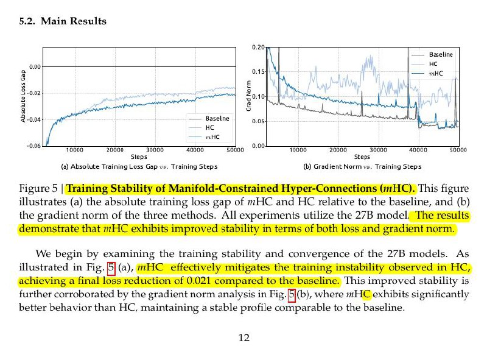

# Image Description

**File:** img_1767782328_aqadhaxrgxqwuup9_figure_5_training_stability_of.jpg
**Original:** image.jpg
**Received:** 1767782328

## Extracted Text (OCR)

Figure 5 | Training Stability of Manifold-Constrained Hyper-Connections (mH). illustrates (a) the absolute training loss gap of mHC and HC relative to the baseline, and (b) the gradient norm of the three methods. All experiments utilize the 27B model. The results
demonstrate that HC exhibits improved stability in terms of both loss and gradient norm.

<!-- image -->

We begin by examining the training stability and convergence of the 27В models. As illustrated in Fig. Е (a), mHC effectively mitigates the training instability obs —

ichieving a бла] 1033 гедасной of 0.021 compared to the baseline: This improved stability is further corroborated by the gradient norm analysis in Fig. [5{(b), where mHC exhibits significantly better behavior than HC, maintaining a stable profile comparable to the baseline.

## Usage Instructions

When referencing this image in markdown:
1. Use relative path based on file location
2. Add descriptive alt text based on OCR content above
3. Add text description BELOW the image for GitHub rendering

Example:
```markdown
 <!-- TODO: Broken image path -->

**Image shows:** [Describe what the image contains based on OCR]
```
