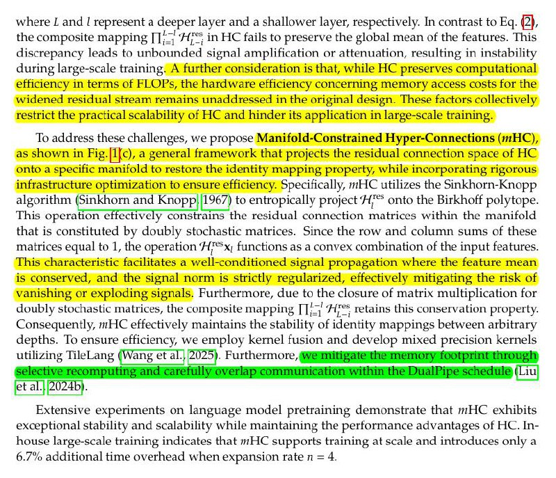

# Image Description

**File:** img_1767782328_aqadhgxrgxqwuup9_where_and_represent_a.jpg
**Original:** image.jpg
**Received:** 1767782328

## Extracted Text (OCR)

where Г and | represent a deeper layer and a shallower layer, respectively. In contrast to Eq. (2), the composite mapping ПП. ней ;\_; in HC fails to preserve the global mean of the features. This discrepancy leads to unbounded signal amplification or attenuation, resulting in instability during large-scale training. A further consideration is that, while HC preserves computational efficiency in terms of FLOPs, the hardware efficiency concerning memory access costs for the widened residual stream remains unaddressed in the original design. These factors collectively restrict the practical scalability of HC and hinder its application in large-scale training.

lo address these challenges, we propose Manifoid-Constrained Hyper-Connections (mHC), A 2 р = a
1 .{1fc),
&amp; а Tene lf =

A} infrastructure optimization to ensure efficiency. Specitically, mHC utilizes the Sinkhorn-Knopp algorithm (Sinkhorn and Knopp!/1967) to entropically project 'H"™ onto the Birkhoff polytope.
5 : PP) 4707 Р у pro} 1 polytop This operation ettectively constrains the residual connection matrices within the manifold that is constituted by doubly stochastic matrices. Since the row and column sums of these matrices equal to 1, the operation 'Hx, functions as a convex combination of the input features. is conserved, and the signal norm is strictly rezularized, ettectively mitigating the risk of Vanishing or exploding signals. Furthermore, due to the closure of matrix multiplication for doubly stochastic matrices, the composite mapping Tha 'AA. retains this conservation property. Consequently, mHC effectively maintains the stability of identity mappings between arbitrary depths. lo ensure efficiency, we employ kernel fusion and develop mixed precision kernels utilizing TileLang (Wang et al.)/2025). Furthermore, ме пийрае Ме тетпоту Кнургиае тиц К

Extensive experiments on language model pretraining demonstrate that mHC exhibits exceptional stability and scalability while maintaining the performance advantages of HC. Inhouse large-scale training indicates that mHC supports training at scale and introduces only a b.//o additional time overhead when expansion rate n = 4.

## Usage Instructions

When referencing this image in markdown:
1. Use relative path based on file location
2. Add descriptive alt text based on OCR content above
3. Add text description BELOW the image for GitHub rendering

Example:
```markdown
 <!-- TODO: Broken image path -->

**Image shows:** [Describe what the image contains based on OCR]
```
