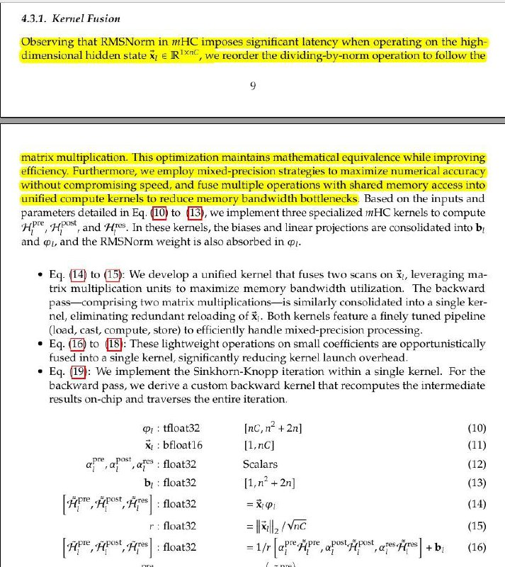

# Image Description

**File:** img_1767782328_aqadhqxrgxqwuup9_431_kernel_fusion_ted_compute.jpg
**Original:** image.jpg
**Received:** 1767782328

## Extracted Text (OCR)

## 431 Kernel! Fusion

Ted compute kernels to reduce memory bandwidth bottlenecks. Based on the inputs and parameters detailed in Eq. (10) to ПЗ} we implement three specialized mHC kernels to compute "yp Pee post | v 5 а EE: + 4 a ye
Hr, Hy; and 'Ht'. In these kernels, the biases and linear projections are consolidated into b, and a), and the RMSNorm weicht is also absorbed in «).

* Eq. (14) to (15): We develop а unified kernel that fuses two scans on x), leveraging matrix multiplication units to Maximize memory banawidth utilization. [he backward ass—CoOmMprising Био matrix multiplications—is я milarly consolidated into а single kernel, eliminating redundant reloading of x;. Both kernels feature a finely tuned pipeline oad, cast, compute, store) to efhciently handle mixed-precision processing.
* Eq. to 18}: These lightweight operations on small coefficients are opportunistically fused into а single kernel, sienificantly reducing Kernel launch overhead.
- " Eq. {19}: We implement the Sinkhorn-Knopp iteration within a single kernel. For the backward pass, We derive a custom backward kernel that recomputes the intermediate results on-chip and traverses the entire iteration.

<!-- formula-not-decoded -->

<!-- formula-not-decoded -->

<!-- formula-not-decoded -->

<!-- formula-not-decoded -->

<!-- formula-not-decoded -->

<!-- formula-not-decoded -->

<!-- formula-not-decoded -->

## Usage Instructions

When referencing this image in markdown:
1. Use relative path based on file location
2. Add descriptive alt text based on OCR content above
3. Add text description BELOW the image for GitHub rendering

Example:
```markdown
 <!-- TODO: Broken image path -->

**Image shows:** [Describe what the image contains based on OCR]
```
