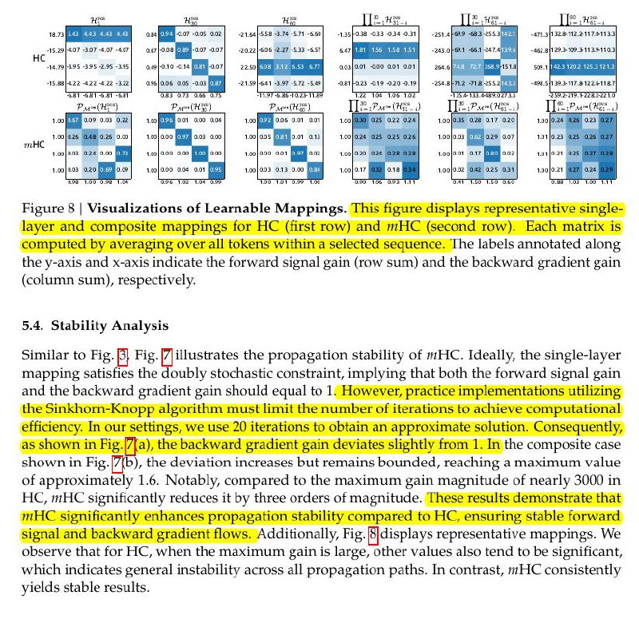

# Image Description

**File:** img_1767782328_aqadhwxrgxqwuup9_ficure_visualizations_of_learnable.jpg
**Original:** image.jpg
**Received:** 1767782328

## Extracted Text (OCR)

Ficure в | Visualizations of Learnable Mappings. Ihe labels annotated along the y-axis and x-axis indicate the forward signal gain (row sum) and the backward gradient gain (column sum), respectively.

<!-- image -->

## 5.4, Stability Analysis

Similar to Fig. 3} Fig. |/| illustrates the propagation stability of mHC. Ideally, the single-layer mapping satishies the doubly stochastic constraint, implying that both the forward signal gain and the backward gradient gain should equal to 1. However, practice implementations utilizing 1 the composite case shown in Fig. |/{b), the deviation increases but remains bounded, reaching a maximum value of approximately 1.6. Notably, compared to the maximum gain magnitude of nearly 3000 in HC, mHC significantly reduces it py three orders of magnitude. [hese results demonstrate that signal and backward gradient flows. Additionally, Fig. S\displays representative mappings. We observe that for HC, when the maximum gain is large, other values also tend to be significant, which incicates general instability across all propagation paths. In contrast, mHC consistently yields stable results.

## Usage Instructions

When referencing this image in markdown:
1. Use relative path based on file location
2. Add descriptive alt text based on OCR content above
3. Add text description BELOW the image for GitHub rendering

Example:
```markdown
 <!-- TODO: Broken image path -->

**Image shows:** [Describe what the image contains based on OCR]
```
