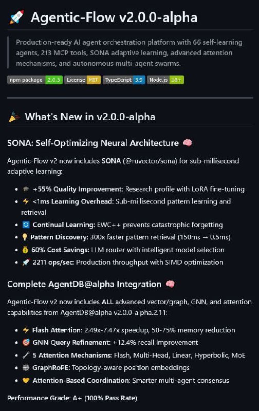

# Image Description

**File:** img_1768094241_aqaddw9rg9h1get9_image_agentic_flow.jpg
**Original:** image.jpg
**Received:** 1768094241

## Extracted Text (OCR)

<!-- image -->

## @ Agentic-Flow v2.0.0-alpha

Production-ready Al agent orchestration plattrorm with 66.sel-learning agents, 213 MCP tools, SONA adaptive learning, advanced attention Mechanisms, and autonomous multi-agent swarms.

<!-- image -->

<!-- image -->

<!-- image -->

<!-- image -->

## р What's New т v2.0.0-alpna

<!-- image -->

<!-- image -->

SONA: Self-Optimizing Neural Architecture &amp;

Agentc-Flow v2 now includes SONA (@ruvector/sana) for sub-millisecond adaptive learning:

- « @ +555 Quality Improvement: Research protile with LoRA tine-tuning
- « + &lt;1ms Learning Overhead: Sub-mullisecond pattem learning and ие ета |
- « (© Continual Learning: EV/C++ prevents catastrophic forgetting
- « § Pattern Discovery: 300x faster pattern retrieval (150ms — 0.5ms5]
- « @ 60% Cost Savings: LLM router with intelligent model selection
- « Ж 2211 ops/sec Production throughput with SIMD optimization

## Complete AgentDB@alpha Integration @

Agentic-Flow v2 now includes ALL advanced vectorfgrapn, GNWN, and attention capabilities irom Agent B@alona v2.U.0-alpna.2.1 1:

+ © Flash Attention: 2.49x-7.47x speedup, 50-75% memory reduction
- « @ GNN Query Refinement: +12.4% recall improvement
- « / 5 Attention Mechanisms: Flash, Multi-Head, Linear, Hyperbolic, MoE
- « # GraphRoPE: Topology-aware position embeddings
- « @ Attention-Based Coordination: Smarter mult-agent consensus

## Usage Instructions

When referencing this image in markdown:
1. Use relative path based on file location
2. Add descriptive alt text based on OCR content above
3. Add text description BELOW the image for GitHub rendering

Example:
```markdown
 <!-- TODO: Broken image path -->

**Image shows:** [Describe what the image contains based on OCR]
```
