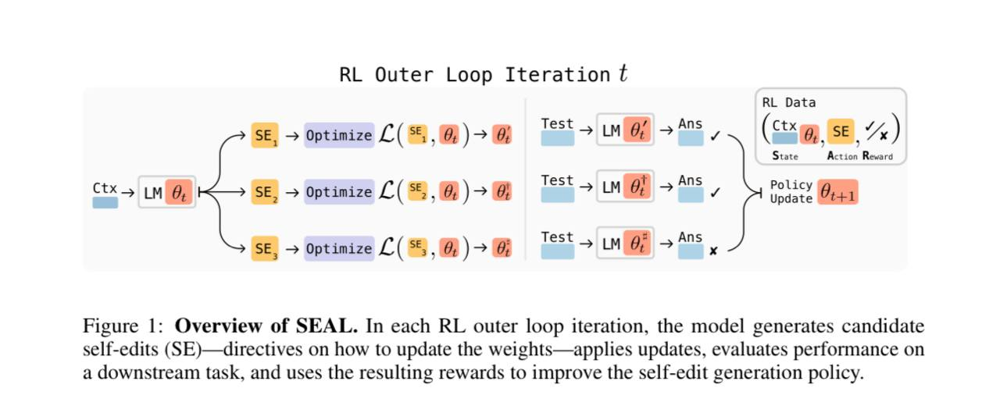

# Image Description

**File:** img_1768094275_aqad2hbrg9qocut_rl_outer_loop_iteration_lt.jpg
**Original:** image.jpg
**Received:** 1768094275

## Extracted Text (OCR)

## RL Outer Loop Iteration lt

<!-- image -->

Figure 1: Overview of SEAL. In each RL outer loop iteration, the model generates candidate self-edits (SE)—directives on how to update the weights—applies updates, evaluates performance on a downstream task, and uses the resulting rewards to improve the self-edit generation policy.

## Usage Instructions

When referencing this image in markdown:
1. Use relative path based on file location
2. Add descriptive alt text based on OCR content above
3. Add text description BELOW the image for GitHub rendering

Example:
```markdown
 <!-- TODO: Broken image path -->

**Image shows:** [Describe what the image contains based on OCR]
```
