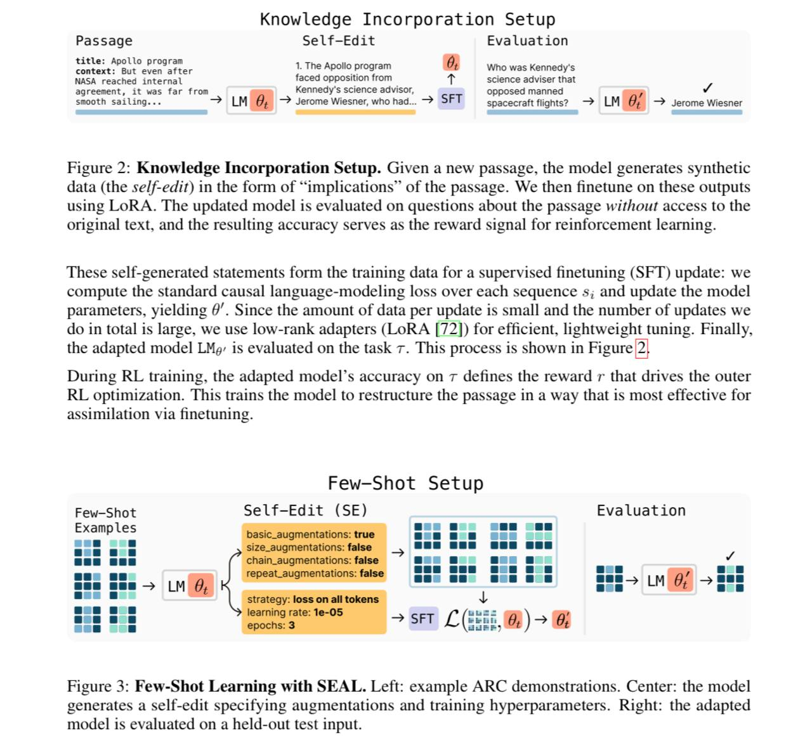

# Image Description

**File:** img_1768094275_aqad2rbrg9qocut_figure_2_knowledge_incorporation_setup_g.jpg
**Original:** image.jpg
**Received:** 1768094275

## Extracted Text (OCR)

Figure 2: Knowledge Incorporation Setup. Given a new passage, the model generates synthetic data (the se/f-edit) in the form of "implications" of the passage. We then finetune on these outputs using LoRA. The updated model 1s evaluated on questions about the passage without access to the Original text, and the resulting accuracy serves as the reward signal for reinforcement learning.

<!-- image -->

These self-generated statements form the training data for a supervised finetuning (SFT) update: we compute the standard causal language-modeling loss over each sequence s; and update the model parameters, yielding 9'. Since the amount of data per update is small and the number of updates we the adapted model LMy: is evaluated on the task т. This process is shown in Figure |2]

During RL training, the adapted model's accuracy on т defines the reward г that drives the outer RL optimization. This trains the model to restructure the passage ш a way that is most effective for assimilation via finetuning.

Few-Shot Setup

Figure 3: Few-Shot Learning with SEAL. Left: example ARC demonstrations. Center: the model generates a self-edit specifying augmentations and training hyperparameters. Right: the adapted mode! is evaluated on a held-out test input.

<!-- image -->

## Usage Instructions

When referencing this image in markdown:
1. Use relative path based on file location
2. Add descriptive alt text based on OCR content above
3. Add text description BELOW the image for GitHub rendering

Example:
```markdown
 <!-- TODO: Broken image path -->

**Image shows:** [Describe what the image contains based on OCR]
```
