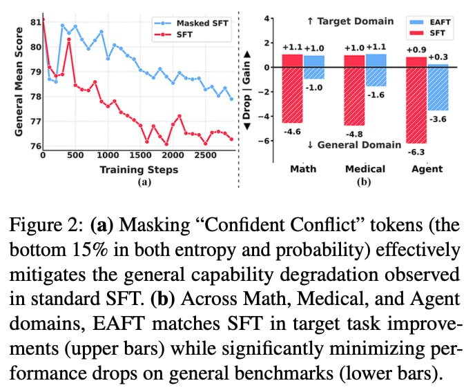

# Image Description

**File:** img_1768118075_aqadqgxrg21aeut9_figure_2_a_masking_confident_conflict.jpg
**Original:** image.jpg
**Received:** 1768118075

## Extracted Text (OCR)

Figure 2: (a) Masking "Confident Conflict" tokens (the bottom 15% in both entropy and probability) effectively mitigates the general capability degradation observed in standard SFT. (b) Across Math, Medical, and Agent domains, EAFT matches SFT in target task improvements (upper bars) while significantly minimizing performance drops on general benchmarks (lower bars).

<!-- image -->

## Usage Instructions

When referencing this image in markdown:
1. Use relative path based on file location
2. Add descriptive alt text based on OCR content above
3. Add text description BELOW the image for GitHub rendering

Example:
```markdown
 <!-- TODO: Broken image path -->

**Image shows:** [Describe what the image contains based on OCR]
```
