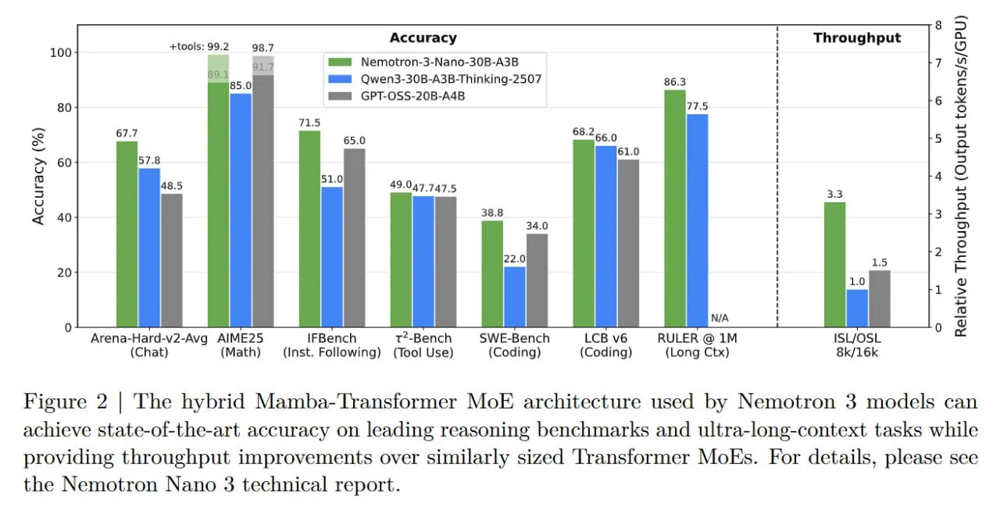

# Image Description

**File:** img_1768119833_aqad0atrg0pniep_figure_2_the_hybrid_mamba_transformer.jpg
**Original:** image.jpg
**Received:** 1768119833

## Extracted Text (OCR)

Figure 2 | The hybrid Mamba-Transformer MoE architecture used by Nemotron 3 models can achieve state-of-the-art accuracy on leading reasoning benchmarks and ultra-long-context tasks while providing throughput improvements over similarly sized 'lransformer MoEs. For details, please see the Nemotron Nano 3 technical report.

<!-- image -->

## Usage Instructions

When referencing this image in markdown:
1. Use relative path based on file location
2. Add descriptive alt text based on OCR content above
3. Add text description BELOW the image for GitHub rendering

Example:
```markdown
 <!-- TODO: Broken image path -->

**Image shows:** [Describe what the image contains based on OCR]
```
