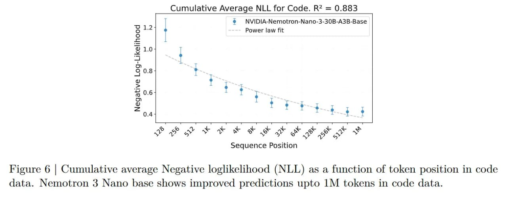

# Image Description

**File:** img_1768119833_aqadzqtrg0pniep_figure_6_cumulative_average_negative.jpg
**Original:** image.jpg
**Received:** 1768119833

## Extracted Text (OCR)

Figure 6 | Cumulative average Negative loglikelihood (NLL) as a function of token position in code data. Nemotron 3 Nano base shows improved predictions upto 1M tokens in code data.

<!-- image -->

## Usage Instructions

When referencing this image in markdown:
1. Use relative path based on file location
2. Add descriptive alt text based on OCR content above
3. Add text description BELOW the image for GitHub rendering

Example:
```markdown
 <!-- TODO: Broken image path -->

**Image shows:** [Describe what the image contains based on OCR]
```
