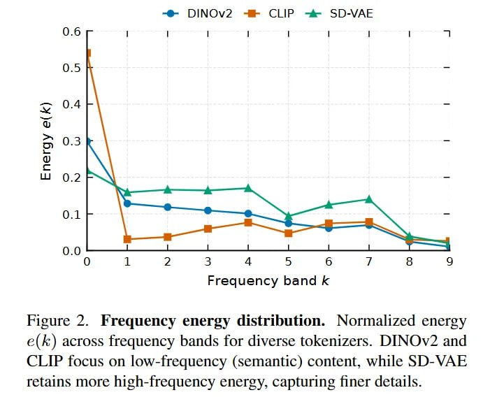

# Image Description

**File:** img_1768119966_aqad2gxrg0pnkep9_figure_2_frequency_energy_distribution_n.jpg
**Original:** image.jpg
**Received:** 1768119966

## Extracted Text (OCR)

Figure 2. Frequency energy distribution. Normalized energy e(k) across frequency bands for diverse tokenizers. DINOv2 and CLIP focus on low-frequency (semantic) content, while SD-VAE retains more high-frequency energy, capturing finer details.

<!-- image -->

## Usage Instructions

When referencing this image in markdown:
1. Use relative path based on file location
2. Add descriptive alt text based on OCR content above
3. Add text description BELOW the image for GitHub rendering

Example:
```markdown
 <!-- TODO: Broken image path -->

**Image shows:** [Describe what the image contains based on OCR]
```
