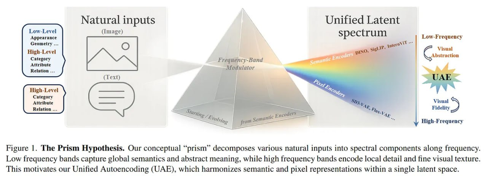

# Image Description

**File:** img_1768119966_aqad2qxrg0pnkep_figure_the_prism_hypothesis_our.jpg
**Original:** image.jpg
**Received:** 1768119966

## Extracted Text (OCR)

Figure |. The Prism Hypothesis. Our conceptual "prism" decomposes various natural inputs into spectral components along frequency. Low frequency bands capture global semantics and abstract meaning, while high frequency bands encode local detail and fine visual texture. This motivates our Unified Autoencoding (UAE), which harmonizes semantic and pixel representations within a single latent space.

<!-- image -->

## Usage Instructions

When referencing this image in markdown:
1. Use relative path based on file location
2. Add descriptive alt text based on OCR content above
3. Add text description BELOW the image for GitHub rendering

Example:
```markdown
 <!-- TODO: Broken image path -->

**Image shows:** [Describe what the image contains based on OCR]
```
