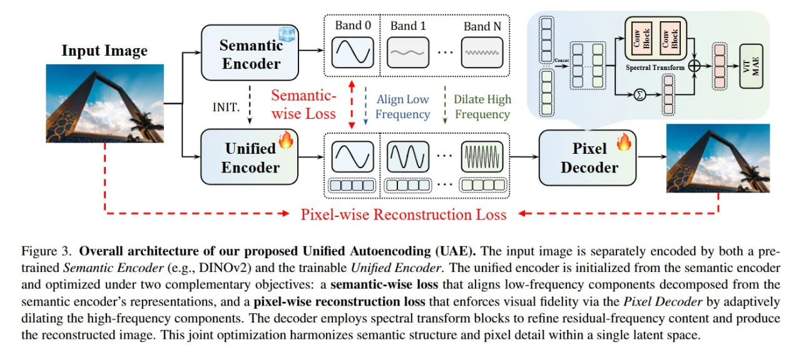

# Image Description

**File:** img_1768119966_aqad2wxrg0pnkep_figure_3_overall_architecture_of_our.jpg
**Original:** image.jpg
**Received:** 1768119966

## Extracted Text (OCR)

Figure 3. Overall architecture of our proposed Unified Autoencoding (UAE). The input image 1$ separately encoded by both a pretrained Semantic Encoder (e.g., DINOv2) and the trainable Unified Encoder. Ге untied encoder 1s initialized from the semantic encoder and optimized under two complementary objectives: a semantic-wise loss that aligns low-frequency components decomposed from the semantic encoder's representations, and a pixel-wise reconstruction loss that enforces visual fidelity via the Pixel Decoder by adaptively dilating the high-frequency components. [he decoder employs spectral transform blocks to refine residual-frequency content and produce the reconstructed image. [his joint optimization harmonizes semantic structure and pixel detail within a single latent space.

<!-- image -->

## Usage Instructions

When referencing this image in markdown:
1. Use relative path based on file location
2. Add descriptive alt text based on OCR content above
3. Add text description BELOW the image for GitHub rendering

Example:
```markdown
 <!-- TODO: Broken image path -->

**Image shows:** [Describe what the image contains based on OCR]
```
