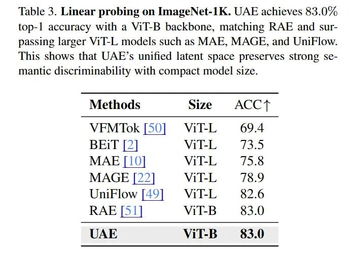

# Image Description

**File:** img_1768119966_aqad4axrg0pnkep9_table_3_linear_probing_on_imagenet_1k.jpg
**Original:** image.jpg
**Received:** 1768119966

## Extracted Text (OCR)

Table 3. Linear probing on ImageNet-1K. UAE achieves 83.0% [ор-1 accuracy with a Vil-B backbone, matching КАЕ and surpassing larger Vil-L models such as MAR, MAGE, and Unirlow. This shows that UAE's unified latent space preserves strong semantic discriminability with compact model size.

| Methods Size ACCT            |
|------------------------------|
| VEFMIok | Vil-L 69.4         |
| ВЫ | 2] Vids. 7173.5         |
| MAE | 10] Vil-L 15.5         |
| MAGE }22| #3x®9Vil-L = 7/8.9 |
| UniFlow |149] Vil-L ~~ 82.6  |
| ViI-B  83.0                  |
| LAE                          |

## Usage Instructions

When referencing this image in markdown:
1. Use relative path based on file location
2. Add descriptive alt text based on OCR content above
3. Add text description BELOW the image for GitHub rendering

Example:
```markdown
 <!-- TODO: Broken image path -->

**Image shows:** [Describe what the image contains based on OCR]
```
