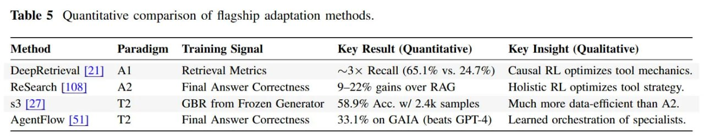

# Image Description

**File:** img_1768120154_aqad5a9rg4equp_table_gt_quantitative_comparison_of_flag.jpg
**Original:** image.jpg
**Received:** 1768120154

## Extracted Text (OCR)

Table &gt; Quantitative comparison of flagship adaptation methods.

| Method Paradigm Training Signal Key Result (Quantitative) Key Insight (Qualitative)                           |
|---------------------------------------------------------------------------------------------------------------|
| DeepRetrieval |21} Al Retrieval Metrics ~3X Recall (65.1% vs. 24.7%) Causal RL optimizes tool mechanics.      |
| Research [108] A2 Final Answer Correctness 922% gains over RAG Holistic RL optimizes tool strategy.           |
| $3  2]  12  GBR from Frozen Generator  38.9% Acc. w/ 2.4k samples  Much more data-efficient than A2.          |
| AgentFlow [51] 2 Final Answer Correctness 33.1% on GAIA (beats GPT-4) — Learned orchestration of specialists. |

## Usage Instructions

When referencing this image in markdown:
1. Use relative path based on file location
2. Add descriptive alt text based on OCR content above
3. Add text description BELOW the image for GitHub rendering

Example:
```markdown
 <!-- TODO: Broken image path -->

**Image shows:** [Describe what the image contains based on OCR]
```
