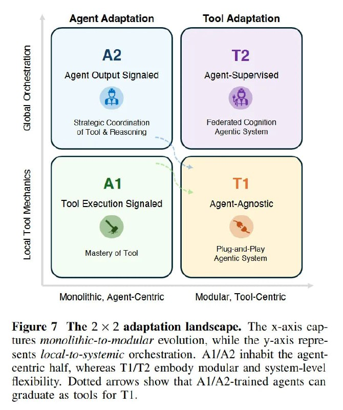

# Image Description

**File:** img_1768120154_aqad6q9rg4equp9_image_kigure_ihe.jpg
**Original:** image.jpg
**Received:** 1768120154

## Extracted Text (OCR)

<!-- image -->

Kigure / Ihe 2х 2 adaptation landscape. The x-axis captures monolithic-to-modular evolution, while the y-axis represents /ocal-to-systemic orchestration. АГА? inhabit the agentcentric half, whereas ГГ? embody modular and system-level Hexibility. Dotted arrows show that Al/A2-trained agents can graduate as tools for I 1.

## Usage Instructions

When referencing this image in markdown:
1. Use relative path based on file location
2. Add descriptive alt text based on OCR content above
3. Add text description BELOW the image for GitHub rendering

Example:
```markdown
 <!-- TODO: Broken image path -->

**Image shows:** [Describe what the image contains based on OCR]
```
