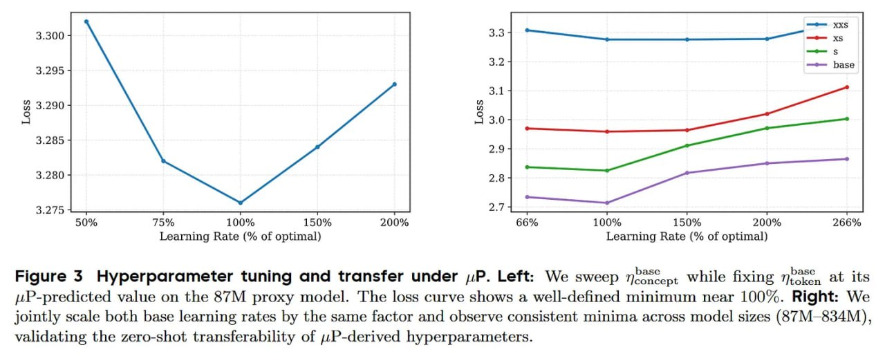

# Image Description

**File:** img_1768120534_aqaddgtrgia4ep_figure_3_hyperparameter_tuning_and_trans.jpg
**Original:** image.jpg
**Received:** 1768120534

## Extracted Text (OCR)

Figure 3 Hyperparameter tuning and transfer under ,.P. Left: We sweep По бер while fixing 12°, at its token juP-predicted value on the 87M proxy model. The loss curve shows a well-defined minimum near 100%. Right: We jointly scale both base learning rates by the same factor and observe consistent minima across model sizes (87М--834М }, validating the zero-shot transferability of .P-derived hyperparameters.

<!-- image -->

## Usage Instructions

When referencing this image in markdown:
1. Use relative path based on file location
2. Add descriptive alt text based on OCR content above
3. Add text description BELOW the image for GitHub rendering

Example:
```markdown
 <!-- TODO: Broken image path -->

**Image shows:** [Describe what the image contains based on OCR]
```
