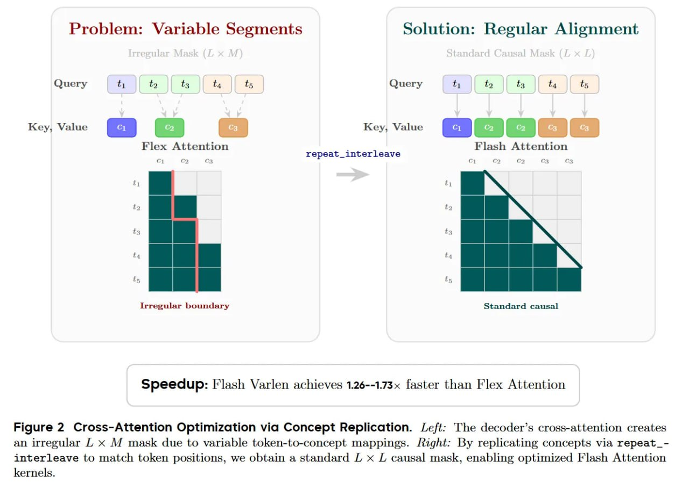

# Image Description

**File:** img_1768120534_aqaddqtrgia4ep_image_speedup_flash_varlen.jpg
**Original:** image.jpg
**Received:** 1768120534

## Extracted Text (OCR)

<!-- image -->

Speedup: Flash Varlen achieves 1.26--1.73x faster than Flex Attention

Figure 2 Cross-Attention Optimization via Concept Replication. Left: The decoder's cross-attention creates an irregular L x М mask due to variable token-to-concept mappings. Aight: By replicating concepts via repeat\_-interleave to match token positions, we obtain a standard L x L causal mask, enabling optimized Flash Attention kernels.

## Usage Instructions

When referencing this image in markdown:
1. Use relative path based on file location
2. Add descriptive alt text based on OCR content above
3. Add text description BELOW the image for GitHub rendering

Example:
```markdown
 <!-- TODO: Broken image path -->

**Image shows:** [Describe what the image contains based on OCR]
```
