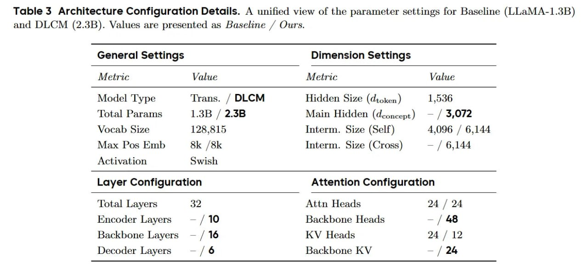

# Image Description

**File:** img_1768120534_aqaddwtrgia4ep_table_3_architecture_configuration_detai.jpg
**Original:** image.jpg
**Received:** 1768120534

## Extracted Text (OCR)

Table 3 Architecture Configuration Details. A unified view of the parameter settings for Baseline (LLaMA-1.3B) and DLCM (2.3B). Values are presented as Baseline / Ours.

| General Settings Dimension Settings         | General Settings Dimension Settings                                                                                                                                                                                   |
|---------------------------------------------|-----------------------------------------------------------------------------------------------------------------------------------------------------------------------------------------------------------------------|
|                                             | Value  Ме                                                                                                                                                                                                             |
|                                             | Model Type Trans. / DLCM Hidden Size (dtoken ) 1,536 Total Params 1.3B / 2.3B Main Hidden (deoncept) — / 3,072 Vocab Size 128,815 Interm. Size (Self) 4,096 / 6,144 Max Pos Emb 8k /8k Interm. Size (Cross) — / 6,144 |
| Layer Configuration Attention Configuration | Layer Configuration Attention Configuration                                                                                                                                                                           |
|                                             | Total Layers 32 Attn Heads 24 / 24 Encoder Layers — / 10 Backbone Heads — / 48 Backbone Layers — / 16 KV Heads 24 / 12 Decoder Layers — /6 Backbone KV — | 24                                                         |

## Usage Instructions

When referencing this image in markdown:
1. Use relative path based on file location
2. Add descriptive alt text based on OCR content above
3. Add text description BELOW the image for GitHub rendering

Example:
```markdown
 <!-- TODO: Broken image path -->

**Image shows:** [Describe what the image contains based on OCR]
```
