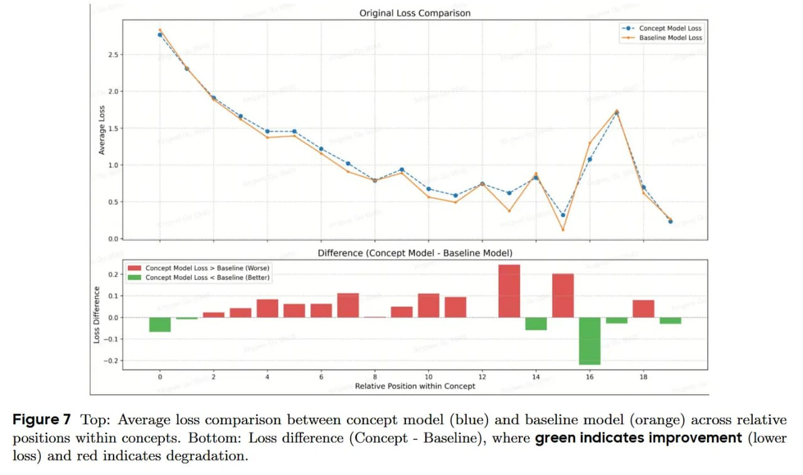

# Image Description

**File:** img_1768120534_aqadegtrgia4ep_figure_7_average_loss_comparison.jpg
**Original:** image.jpg
**Received:** 1768120534

## Extracted Text (OCR)

Figure 7 Тор: Average loss comparison between concept model (blue) and baseline model (orange) across relative positions within concepts. Bottom: Loss difference (Concept - Baseline), where green indicates improvement (lower loss) and red indicates degradation.

<!-- image -->

## Usage Instructions

When referencing this image in markdown:
1. Use relative path based on file location
2. Add descriptive alt text based on OCR content above
3. Add text description BELOW the image for GitHub rendering

Example:
```markdown
 <!-- TODO: Broken image path -->

**Image shows:** [Describe what the image contains based on OCR]
```
