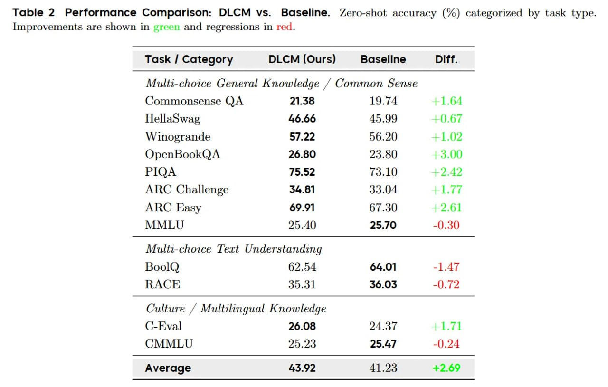

# Image Description

**File:** img_1768120534_aqadeqtrgia4ep_table_2_performance_comparison_dlcm_vs.jpg
**Original:** image.jpg
**Received:** 1768120534

## Extracted Text (OCR)

Table 2 Performance Comparison: DLCM vs. Baseline. Zero-shot accuracy (%) categorized by task type. Improvements are shown in erect and regressions in red.

| Task / Category DLCM (Ours) Baseline Diff.    |
|-----------------------------------------------|
| Multi-choice General Knowledge / Common Sense |
| Commonsense QA 21.38 19.74 + 1.64             |
| HellaSwag 46.66 45.99 - 9.67                  |
| W inogrande 57.22 06.20 +1.02                 |
| OpenBookQA 26.80 23.80 $3.00                  |
| PIQA  75.52  73.10  - 2.12                    |
| ARC Challenge  34.81  33.04  +1.77            |
| ARC Easy  69.91  67.30  +2.61                 |
| 25.70  -(). 30                                |
| Mutti-choice Text Understanding               |
| BoolQ  62.54  64.01  -1.47                    |
| RACE 35.31 36.03 -(}.72                       |
| Culture / Multilingual Knowledge              |
| (Кима  26.08  24.37  Shs                      |
| CMMLU 5.93 25.47 -(). 9A                      |
| Average 43.92 41.23 +2.69                     |

## Usage Instructions

When referencing this image in markdown:
1. Use relative path based on file location
2. Add descriptive alt text based on OCR content above
3. Add text description BELOW the image for GitHub rendering

Example:
```markdown
 <!-- TODO: Broken image path -->

**Image shows:** [Describe what the image contains based on OCR]
```
