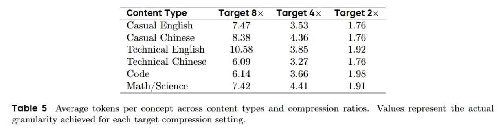

# Image Description

**File:** img_1768120534_aqadewtrgia4ep_content_type_target8x_target4x_target.jpg
**Original:** image.jpg
**Received:** 1768120534

## Extracted Text (OCR)

| Content Type Target8x Target4x Target 2x   |
|--------------------------------------------|
| Casual English 1.40 3.00 1.76              |
| (Clasual Chinese < 35 4 36 176             |
| Lechnical English  10.58  3.00  1.92       |
| Technical Chinese  6.09  327  1.76         |
| $.  е  6.14  3 66  1.98                    |
| Math/Science 7.42 4.41 1.91                |

Table 5 Average tokens per concept across content types and compression ratios. Values represent the actual granularity achieved for each target compression setting.

## Usage Instructions

When referencing this image in markdown:
1. Use relative path based on file location
2. Add descriptive alt text based on OCR content above
3. Add text description BELOW the image for GitHub rendering

Example:
```markdown
 <!-- TODO: Broken image path -->

**Image shows:** [Describe what the image contains based on OCR]
```
