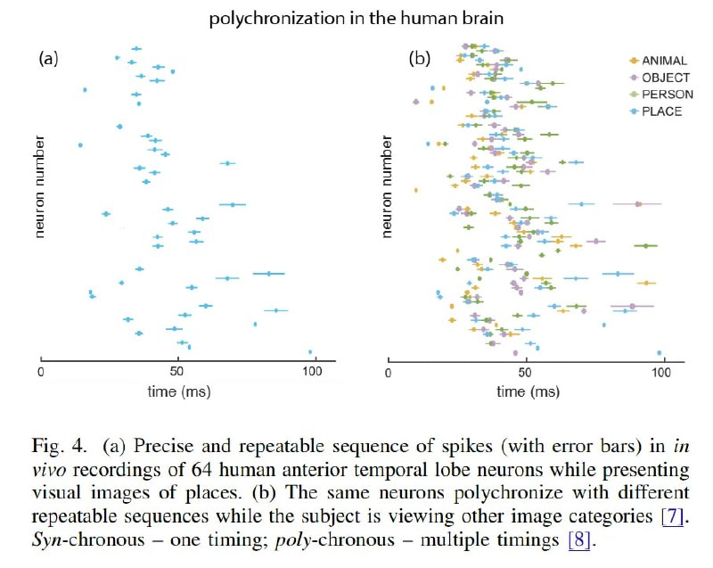

# Image Description

**File:** img_1768120807_aqad0qtrg50feut9_polychronization_in_the_human_brain.jpg
**Original:** image.jpg
**Received:** 1768120807

## Extracted Text (OCR)

## polychronization in the human brain

rig. 4. (a) Precise and repeatable sequence от spikes (with error bars) in in vivo recordings of 64 human anterior temporal lobe neurons while presenting visual images of places. (b) The same neurons polychronize with different repeatable sequences while the subject 1$ viewing other image categories | /]. Syn-chronous — one timing; po/y-chronous — multiple timings |8].

<!-- image -->

## Usage Instructions

When referencing this image in markdown:
1. Use relative path based on file location
2. Add descriptive alt text based on OCR content above
3. Add text description BELOW the image for GitHub rendering

Example:
```markdown
 <!-- TODO: Broken image path -->

**Image shows:** [Describe what the image contains based on OCR]
```
