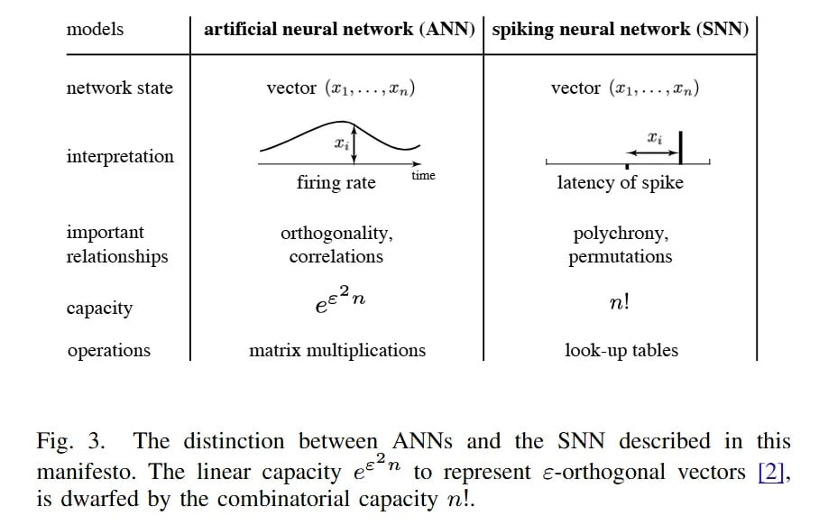

# Image Description

**File:** img_1768120807_aqad1atrg50feut_34_the_distinction_between_anns.jpg
**Original:** image.jpg
**Received:** 1768120807

## Extracted Text (OCR)

Но. 34. The distinction between ANNs and the SNN described ш this manifesto. The linear capacity е^ " to represent ¢-orthogonal vectors [2]. is dwarfed by the combinatorial capacity n!.

<!-- image -->

## Usage Instructions

When referencing this image in markdown:
1. Use relative path based on file location
2. Add descriptive alt text based on OCR content above
3. Add text description BELOW the image for GitHub rendering

Example:
```markdown
 <!-- TODO: Broken image path -->

**Image shows:** [Describe what the image contains based on OCR]
```
