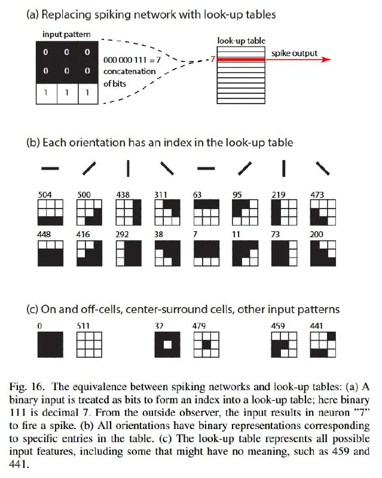

# Image Description

**File:** img_1768120807_aqad1gtrg50feut9_a_replacing_spiking_network_with.jpg
**Original:** image.jpg
**Received:** 1768120807

## Extracted Text (OCR)

## (a) Replacing spiking network with look-up tables

<!-- image -->

- (6) Each orientation Nas an index In the look-up table
2. (Е) On and off-cells, center-surround cells, otner input patterns

<!-- image -->

Fig. 16. [he equivalence between spiking networks and look-up tables: (a) A binary input is treated as bits to form an index into a look-up table; here binary 111 is decimal 7. From the outside observer, the input results in neuron 77 to fire a spike. (6) АП onentations have binary representations corresponding to specific entries in the table. (&lt;) The look-up table represents all possible input features, including some that might have no meaning, such as 459 and

<!-- image -->

## Usage Instructions

When referencing this image in markdown:
1. Use relative path based on file location
2. Add descriptive alt text based on OCR content above
3. Add text description BELOW the image for GitHub rendering

Example:
```markdown
 <!-- TODO: Broken image path -->

**Image shows:** [Describe what the image contains based on OCR]
```
