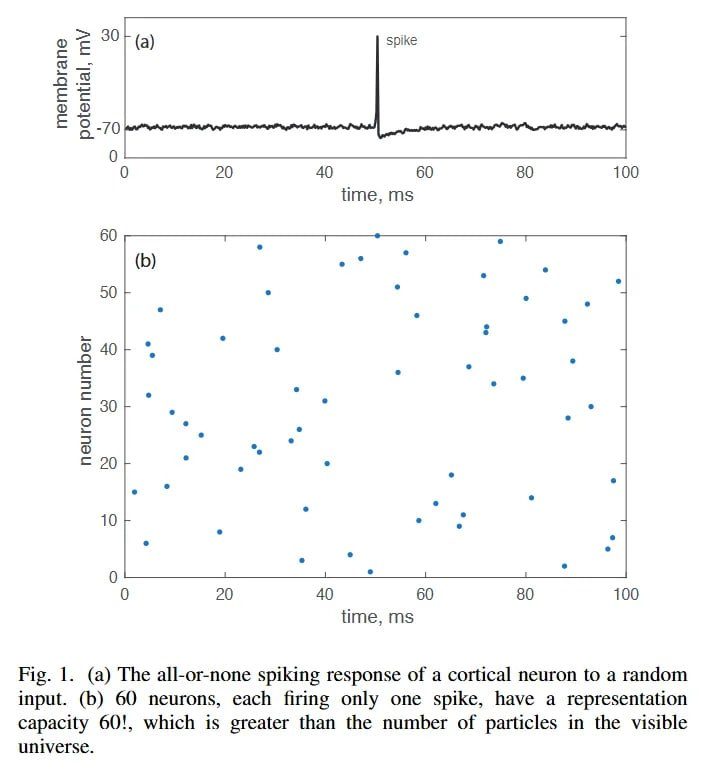

# Image Description

**File:** img_1768120807_aqad1qtrg50feut9_fig_a_the_all_or_none_spiking.jpg
**Original:** image.jpg
**Received:** 1768120807

## Extracted Text (OCR)

Fig. |. (a) The all-or-none spiking response of a cortical neuron to a random input. (b) 60 neurons, each firing only one spike, have a representation capacity 60!, which 1$ greater than the number of particles in the visible wniverse.

<!-- image -->

## Usage Instructions

When referencing this image in markdown:
1. Use relative path based on file location
2. Add descriptive alt text based on OCR content above
3. Add text description BELOW the image for GitHub rendering

Example:
```markdown
 <!-- TODO: Broken image path -->

**Image shows:** [Describe what the image contains based on OCR]
```
