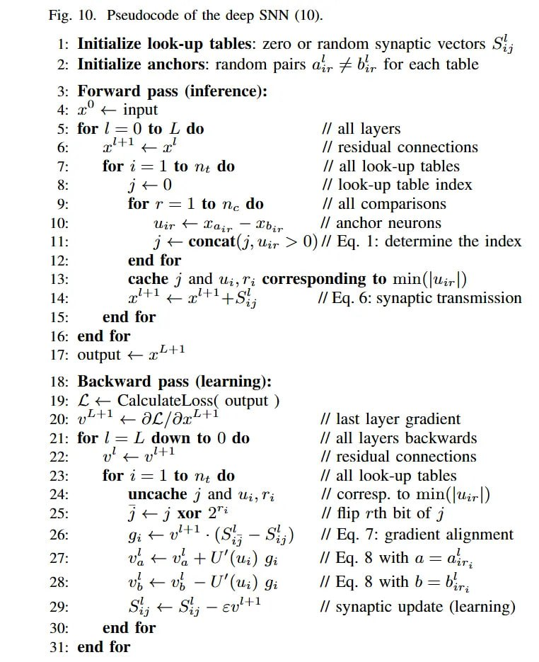

# Image Description

**File:** img_1768120807_aqad1wtrg50feut_0.jpg
**Original:** image.jpg
**Received:** 1768120807

## Extracted Text (OCR)

```
0

<= Г "м - Forward pass (inference): x" < input for {/— 0 to Г do for —= | Юл, do for r = 1 to n,. do ar : Initialize look-up tables: zero or random synaptic vectors 5; : ‚ Initialize anchors: random pairs a;,. + 6;,. for each table // all layers // residual connections // all look-up tables // look-up table index // all comparisons // anchor neurons 1 = сопеа 7, wu; > 0)// Eq. 1: determine the index end tor cache 7 and u;,r; corresponding to min(|w;,-|) „-ё {+1 ЕТ end tor - end for ` OUTPUL — FT г. 1.1 ` Backward pass (learning): £ — CalculateLoss( output ) wt + OL/dax*™ for Г — |. down to 0 do for 2— 1 to n+ do uncache 7 and uj, 1; Я <7 xor 2" ими"

"+ (Si 7 Si;) ие + U" (ui) в: un < vu, —U' (ui) 9: Si, = Si; -—ev™ end tor end for // Eq. 6: synaptic transmission // last layer gradient // all layers backwards // residual connections // all look-up tables // corresp. to min(|2;,-| ) // tip rth bit of 7 // Eg. /: gradient alignment // Eq. 8 with a = ir, // Eq. 8 with b = bi. // synaptic update (learning)
```

Fig. 10. Pseudocode of the deep SNN (10).

## Usage Instructions

When referencing this image in markdown:
1. Use relative path based on file location
2. Add descriptive alt text based on OCR content above
3. Add text description BELOW the image for GitHub rendering

Example:
```markdown
 <!-- TODO: Broken image path -->

**Image shows:** [Describe what the image contains based on OCR]
```
