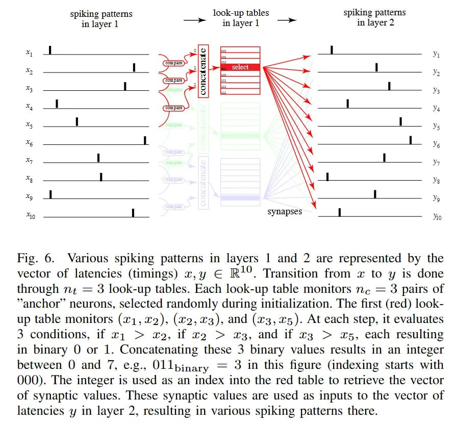

# Image Description

**File:** img_1768120807_aqad2atrg50feut_rig_6_various_spiking_patterns_in.jpg
**Original:** image.jpg
**Received:** 1768120807

## Extracted Text (OCR)

rig. 6. Various spiking patterns in layers | and 2 are represented by the vector of latencies (timings) ху Е R*'. Transition from x to y is done through nz = 3 look-up tables. Each look-up table monitors пе = 3 pairs of "anchor neurons, selected randomly during initialization. [he first (red) lookup table monitors (41, %2), (12, хз), and (уз, 25). At each step, it evaluates 3 conditions, И тт &gt; 212, Ц т2 &gt; #3, and И тз &gt; 15. each resulting in binary O or 1. Concatenating these 3 binary values results in an integer between Q and ФТ, e.g., Ullpinary = 3 Ш this figure (indexing starts with QOQ). [he integer 1$ used as an index into the red table to retrieve the vector of synaptic values. [hese synaptic values are used as inputs to the vector of latencies y in layer 2, resulting ш various spiking patterns there.

<!-- image -->

## Usage Instructions

When referencing this image in markdown:
1. Use relative path based on file location
2. Add descriptive alt text based on OCR content above
3. Add text description BELOW the image for GitHub rendering

Example:
```markdown
 <!-- TODO: Broken image path -->

**Image shows:** [Describe what the image contains based on OCR]
```
