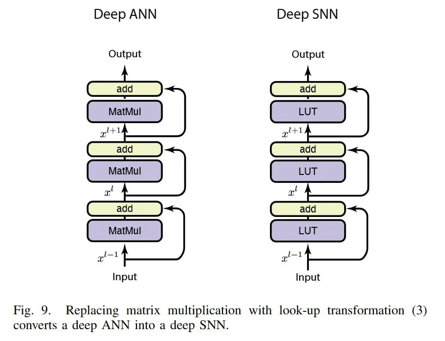

# Image Description

**File:** img_1768120807_aqad2gtrg50feut_rig_9_replacing_matrix_multiplication_wi.jpg
**Original:** image.jpg
**Received:** 1768120807

## Extracted Text (OCR)

rig. 9. Replacing matrix multiplication with look-up transformation (3) converts a deep ANN into a deep SNN.

<!-- image -->

## Usage Instructions

When referencing this image in markdown:
1. Use relative path based on file location
2. Add descriptive alt text based on OCR content above
3. Add text description BELOW the image for GitHub rendering

Example:
```markdown
 <!-- TODO: Broken image path -->

**Image shows:** [Describe what the image contains based on OCR]
```
