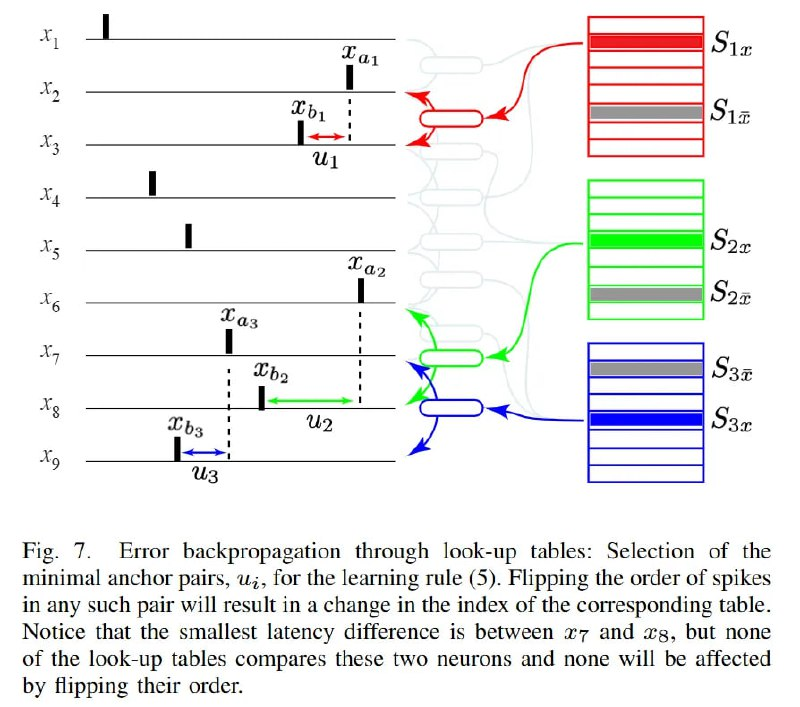

# Image Description

**File:** img_1768120807_aqad2qtrg50feut9_fig_error_backpropagation_through_look_u.jpg
**Original:** image.jpg
**Received:** 1768120807

## Extracted Text (OCR)

Fig. /. Error backpropagation through look-up tables: Selection of the minimal anchor pairs, w;, Гог the learning rule (5). Flipping the order of spikes in any such pair will result in a change in the index of the corresponding table. Notice that the smallest latency difference 1s between x77 and 2g, but none of the look-up tables compares these two neurons and none will be affected by flipping their order.

<!-- image -->

## Usage Instructions

When referencing this image in markdown:
1. Use relative path based on file location
2. Add descriptive alt text based on OCR content above
3. Add text description BELOW the image for GitHub rendering

Example:
```markdown
 <!-- TODO: Broken image path -->

**Image shows:** [Describe what the image contains based on OCR]
```
