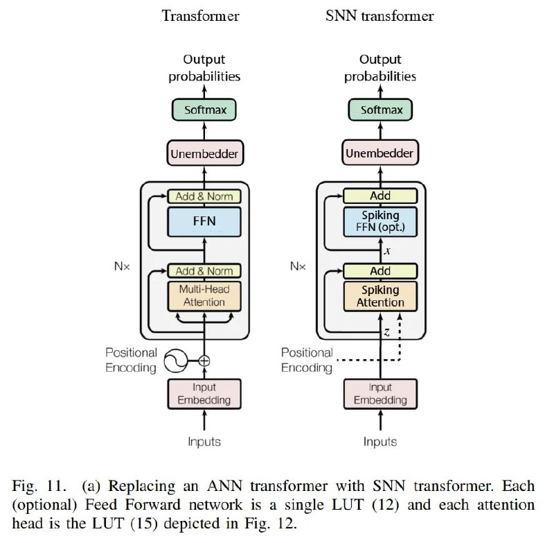

# Image Description

**File:** img_1768120807_aqad2wtrg50feut9_fig_1_a_replacing_an_ann.jpg
**Original:** image.jpg
**Received:** 1768120807

## Extracted Text (OCR)

Fig. |1. (a) Replacing an ANN transformer with SNN transformer. Each (optional) Feed Forward network 1$ a single LUI (12) and each attention head 1$ the LUT (15) depicted in Fig. 12.

<!-- image -->

## Usage Instructions

When referencing this image in markdown:
1. Use relative path based on file location
2. Add descriptive alt text based on OCR content above
3. Add text description BELOW the image for GitHub rendering

Example:
```markdown
 <!-- TODO: Broken image path -->

**Image shows:** [Describe what the image contains based on OCR]
```
