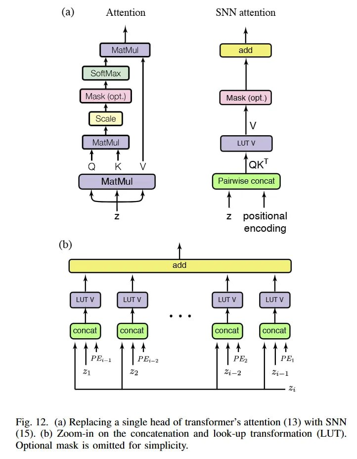

# Image Description

**File:** img_1768120808_aqad3gtrg50feut_fig_12_a_replacing_a_single.jpg
**Original:** image.jpg
**Received:** 1768120808

## Extracted Text (OCR)

Fig. 12. (a) Replacing a single head of transformer's attention (13) with SNN (15). (b) Zoom-in on the concatenation and look-up transformation (LUT). Optional mask is omitted for simplicity.

<!-- image -->

## Usage Instructions

When referencing this image in markdown:
1. Use relative path based on file location
2. Add descriptive alt text based on OCR content above
3. Add text description BELOW the image for GitHub rendering

Example:
```markdown
 <!-- TODO: Broken image path -->

**Image shows:** [Describe what the image contains based on OCR]
```
