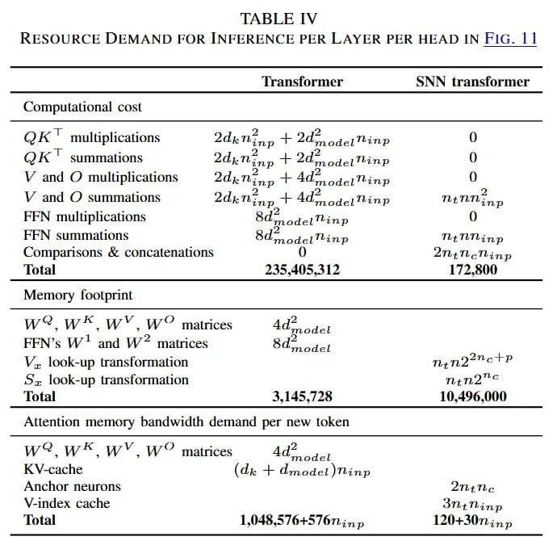

# Image Description

**File:** img_1768120808_aqad3qtrg50feut9_resolurce_ldjemand_for_inference_per_lay.jpg
**Original:** image.jpg
**Received:** 1768120808

## Extracted Text (OCR)

RESOLURCE LDJEMAND FOR INFERENCE PER LAYER PER HEAD IN FIG. ||

| Computational cost                                                                                                                                                                                                                                                                                                                                           |                                                 |
|--------------------------------------------------------------------------------------------------------------------------------------------------------------------------------------------------------------------------------------------------------------------------------------------------------------------------------------------------------------|-------------------------------------------------|
| ОК multiplications 2dk Ninn + 24. odeiMinp Тк ions 2 ФИА © summations 2d),.77,,, + 24, odelTinp V and O multiplications 2di: inp -+- Ade ое Пт : 2 2 V and O summations акти р + Ad” adel Tinp NENT; » 9, НЕМ multiplications 84“ одеть ap . . > A НЕМ summations Я odelTMinp N4eNNinp Comparisons é& concatenations 0 2N¢TeNing Total  245,405 312  172,800 |                                                 |
| Memory [ootprint                                                                                                                                                                                                                                                                                                                                             |                                                 |
| we? ws, WY, Ww” matrices Ad*  model FEN’s W* and И’? matrices 8d-  model V. look-up transformation nyn27*"eTP 5S. look-up transformation len2 © lotal 3.145.728 10,496,000                                                                                                                                                                                   |                                                 |
| Attention memory bandwidth demand per new token                                                                                                                                                                                                                                                                                                              | Attention memory bandwidth demand per new token |
| Wo? ИК, WY, WwW” matrices Ad*  model K V-cache (dx + dmodelt ор Anchor neurons тать. V-index cache StNinp total 1,048,37643 767: пр 1204307 in»                                                                                                                                                                                                              |                                                 |

## Usage Instructions

When referencing this image in markdown:
1. Use relative path based on file location
2. Add descriptive alt text based on OCR content above
3. Add text description BELOW the image for GitHub rendering

Example:
```markdown
 <!-- TODO: Broken image path -->

**Image shows:** [Describe what the image contains based on OCR]
```
