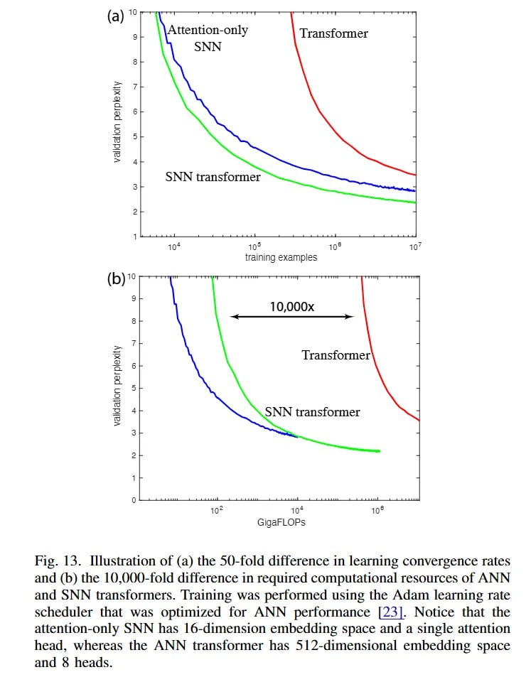

# Image Description

**File:** img_1768120808_aqad3wtrg50feut_fig_13_illustration_of_a_the.jpg
**Original:** image.jpg
**Received:** 1768120808

## Extracted Text (OCR)

Fig. 13. Illustration of (a) the 50-fold difference in learning convergence rates and (b) the 10,000-fold difference in required computational resources of ANN and SNN transformers. Training was performed using the Adam learning rate scheduler that was optimized for ANN performance [23]. Notice that the attention-only SNN has 16-dimension embedding space and a single attention head, whereas the ANN transformer has 512-dimensional embedding space and &amp; heads.

<!-- image -->

## Usage Instructions

When referencing this image in markdown:
1. Use relative path based on file location
2. Add descriptive alt text based on OCR content above
3. Add text description BELOW the image for GitHub rendering

Example:
```markdown
 <!-- TODO: Broken image path -->

**Image shows:** [Describe what the image contains based on OCR]
```
