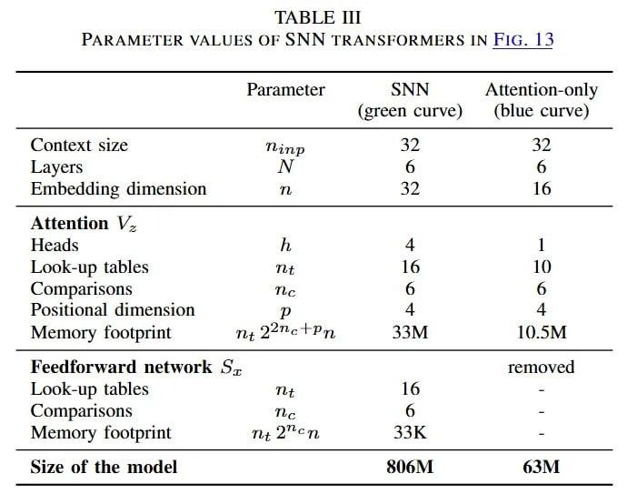

# Image Description

**File:** img_1768120808_aqad4atrg50feut9_parameter_values_of_snwn_transpormers_in.jpg
**Original:** image.jpg
**Received:** 1768120808

## Extracted Text (OCR)

PARAMETER VALUES OF SNWN TRANSPORMERS IN FIG. | 3

|                                       | Parameter SNN Attention-only (green curve) (blue curve)   |
|---------------------------------------|-----------------------------------------------------------|
| (ontext size Thinp                    | Layers                                                    |
| Embedding dimension  Th               |                                                           |
| Attention V.                          |                                                           |
| Heads                                 |                                                           |
| Look-up tables Tht 16 10              |                                                           |
| Comparisons  The                      |                                                           |
| Positional dimension                  |                                                           |
| Memory footprint nz 22% Ру, 33M 10.5M |                                                           |
| Feedforward network 5. removed        |                                                           |
| Look-up tables  Tht                   |                                                           |
| Comparisons  Tis                      |                                                           |
| Memory footprint me 2 en 33K          |                                                           |
| Size of the model  ОМ  =              |                                                           |

## Usage Instructions

When referencing this image in markdown:
1. Use relative path based on file location
2. Add descriptive alt text based on OCR content above
3. Add text description BELOW the image for GitHub rendering

Example:
```markdown
 <!-- TODO: Broken image path -->

**Image shows:** [Describe what the image contains based on OCR]
```
